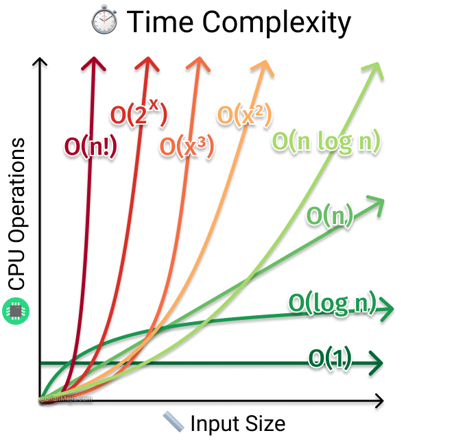
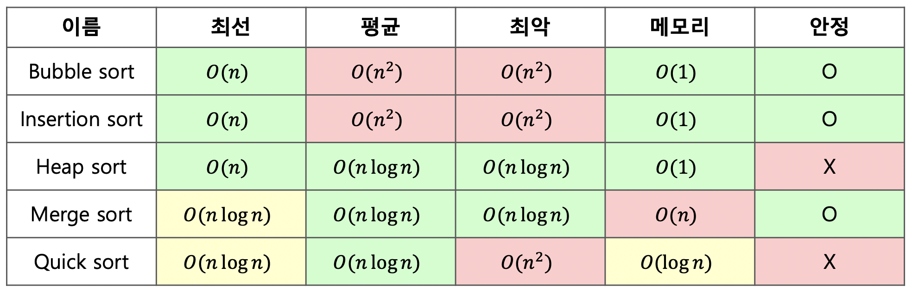
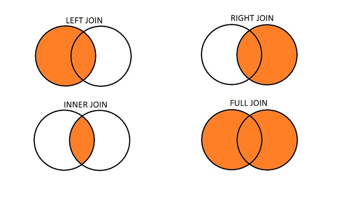

# Computer Science

## 자료구조

선형 자료구조와 비선형 자료구조에 대해 설명해주세요.

- **선형 자료구조**는 데이터 요소들이 일렬로 순차적으로 저장되는 구조로, 각 요소는 최대 하나의 이전 요소와 하나의 다음 요소를 가집니다. 대표적으로 배열, 연결 리스트, 스택, 큐가 있습니다.

  **비선형 자료구조**는 데이터 요소들이 계층적 또는 네트워크 형태로 연결되어 각 요소가 여러 요소와 관계를 맺을 수 있는 구조입니다. 대표적으로 트리, 그래프가 있습니다.

값을 추가 및 삭제할 때 logN의 복잡도가 소요되는 자료구조는?

- **균형 이진 탐색 트리**와 **힙**이 해당됩니다. AVL 트리나 레드-블랙 트리 같은 균형 이진 탐색 트리는 트리 높이를 logN으로 유지하여 삽입, 삭제, 검색을 평균 및 최악의 경우 모두 O(log N)으로 수행합니다. 힙은 완전 이진 트리를 기반으로 하며, 삽입과 삭제 시 O(log N)의 시간이 소요됩니다.

연결 리스트와 해시 테이블에 대해서 설명해 주세요.

- **연결 리스트**는 데이터 노드가 포인터로 연결된 선형 자료구조입니다. 각 노드는 데이터와 다음 노드를 가리키는 포인터를 가지며, 메모리에 비연속적으로 저장될 수 있어 중간 삽입·삭제가 O(1)로 빠릅니다. 반면 특정 인덱스를 검색할 때는 처음부터 순차적으로 탐색해야 하므로 O(n)이 소요됩니다.

  **해시 테이블**은 키-값 쌍을 저장하며, 해시 함수를 사용하여 키를 배열의 인덱스로 변환해 데이터에 빠르게 접근하는 자료구조입니다. 삽입, 삭제, 검색이 평균 O(1)로 빠르며, JavaScript의 Object나 Map이 내부적으로 이와 유사하게 동작합니다.

해쉬 테이블의 검색 시간 복잡도는 항상 O(1)인가요?

- 아닙니다. 해시 테이블의 검색 시간 복잡도는 **평균적으로 O(1)** 이지만, **최악의 경우 O(n)** 이 될 수 있습니다.

  해시 함수가 키를 고르게 분산시켜 **충돌**이 거의 없는 이상적인 경우에는 원하는 데이터에 바로 접근할 수 있습니다. 그러나 모든 데이터가 해시 충돌로 인해 동일한 **버킷**에 저장되면, 해당 버킷 내에서 선형 탐색을 해야 하므로 O(n)의 시간이 걸립니다.

해시 충돌을 해결하는 방법에 대해서 설명해 주세요.

- 대표적으로 **체이닝**과 **개방 주소법**이 있습니다. 체이닝은 충돌이 발생하면 해당 해시 인덱스에 연결 리스트를 만들어 충돌하는 데이터들을 추가하여 저장하는 방식입니다.

  **개방 주소법**은 충돌이 발생하면 미리 정해진 규칙에 따라 다른 비어있는 인덱스를 찾아 데이터를 저장하는 방식입니다.

좋은 해시 함수의 조건은 뭘까요?

- 좋은 해시 함수는 키들을 버킷에 **균등하게 분산**시켜 충돌을 최소화해야 하고, 해시 값을 **신속하게 계산**할 수 있어야 합니다. 또한 동일한 키에 대해서는 항상 **동일한 해시 값**을 반환하는 일관성도 갖춰야 합니다.

Stack과 Queue의 차이에 대해 설명해 주세요

- **Stack**은 **후입선출(LIFO)** 구조로, 삽입은 Push, 삭제는 Pop 연산을 사용합니다. 브라우저 뒤로 가기나 실행 취소 기능이 대표적인 예시입니다.

  **Queue**는 **선입선출(FIFO)** 구조로, 삽입은 Enqueue, 삭제는 Dequeue 연산을 사용합니다. 은행 업무나 놀이기구 대기줄이 대표적인 예시입니다.

List, Map, Set의 차이점을 설명해 주세요.

- **List**는 순서와 중복이 있는 자료구조로, 인덱스로 원소에 접근이 가능하며 크기가 가변적입니다.

  **Map**은 key-value 쌍을 저장하는 자료구조로, key의 중복은 허용되지 않고 순서를 보장하지 않지만 검색 속도가 빠릅니다. value의 중복은 허용됩니다.

  **Set**은 순서가 없고 중복 데이터를 허용하지 않는 자료구조로, 검색 속도가 빠르고 중복 없는 데이터를 구할 때 유용합니다.

시간복잡도와 공간복잡도에 대해 설명해주세요.

- **시간 복잡도**는 알고리즘을 실행하는 데 걸리는 시간이 입력 데이터의 크기에 따라 어떻게 증가하는지를 나타내는 척도입니다. 주로 **Big O 표기법**으로 표현하며 알고리즘의 효율성을 평가하는 데 사용됩니다.

  **공간 복잡도**는 알고리즘이 실행되는 동안 사용하는 **메모리 공간**의 양이 입력 데이터 크기에 따라 어떻게 증가하는지를 나타내는 척도입니다. 마찬가지로 Big O 표기법을 사용합니다.

O(2^n), O(1), O(n^3), O(n!), O(n log n), O(log n), O(n), O(n^2)를 시간복잡도 순서대로 나열해주세요.

- 빠른 순서대로 나열하면 **O(1)** → **O(log n)** → **O(n)** → **O(n log n)** → **O(n²)** → **O(n³)** → **O(2^n)** → **O(n!)** 입니다.

그래프와 트리의 차이점을 설명해주세요.

- **그래프**는 노드와 노드 간의 간선으로 이루어진 자료구조로, **사이클**이 허용되며 모든 노드가 연결되어 있지 않아도 됩니다.

  **트리**는 그래프의 한 종류로, **사이클이 없는 연결 그래프**입니다. 일반적으로 하나의 **루트 노드**를 가지며 **계층적인 구조**를 나타내고, N개의 노드는 항상 N-1개의 간선을 가집니다.

전위순회 vs 중위순회 vs 후위순회 를 비교해서 설명해주세요.

- 핵심적인 차이는 **루트 노드를 언제 방문하느냐**입니다. **전위 순회**는 루트 → 왼쪽 → 오른쪽 순으로 방문합니다.

  **중위 순회**는 왼쪽 → 루트 → 오른쪽 순으로 방문합니다.

  **후위 순회**는 왼쪽 → 오른쪽 → 루트 순으로 방문합니다.

Array (배열) vs Linked List (링크드 리스트) 를 비교해서 설명해주세요.

- **배열**은 메모리에 연속적으로 저장되어 인덱스를 통해 O(1)로 빠르게 접근할 수 있습니다. 다만 크기가 고정되고, 중간 삽입·삭제 시 요소들을 이동시켜야 하므로 평균 O(n)의 시간이 걸립니다.

  **링크드 리스트**는 각 노드가 포인터를 통해 다음 노드를 가리키는 구조로, 동적으로 크기를 조절할 수 있고 중간 삽입·삭제가 O(1)에 가능합니다. 반면 임의 접근이 어려워 검색에는 O(n)의 시간이 필요합니다. 즉, 배열은 빠른 접근이, 링크드 리스트는 유연한 삽입·삭제가 강점입니다.

힙에 대해 설명해주시고, 각 연산의 시간복잡도를 설명해주세요.

- **힙**은 완전 이진 트리 기반의 자료구조로, **최대 힙**과 **최소 힙**이 있습니다. 최댓값·최솟값 탐색은 O(1)이며, 삭제는 루트 노드를 삭제한 뒤 마지막 노드를 루트로 가져와 위치를 재구성하므로 O(log n), 삽입은 마지막 노드에 추가 후 위치를 재구성하므로 O(log n)이 소요됩니다.

AVL트리는 무엇인가요?

- **AVL 트리**는 이진 탐색 트리에서 최악의 경우 선형 트리가 되는 것을 방지하기 위해, 균형을 잡기 위해 트리 일부를 왼쪽 혹은 오른쪽으로 **회전**시키는 **자가 균형 이진 탐색 트리**입니다. 탐색, 삽입, 삭제 모두 시간 복잡도가 O(log n)으로 유지됩니다.

FIFO와 LIFO 형태의 자료구조를 각각 설명해주세요

- **FIFO(First-In-First-Out)** 는 먼저 들어온 데이터가 먼저 나가는 구조로, 대표적인 예로 **큐**가 있습니다. 데이터는 한쪽에서 삽입되고 반대쪽에서 제거되며, 순서가 중요한 작업 처리 시스템에 유용합니다.

  **LIFO(Last-In-First-Out)** 는 나중에 들어온 데이터가 먼저 나가는 구조로, 대표적인 예로 **스택**이 있습니다. 마지막에 넣은 데이터가 먼저 나가며, 함수 호출 스택이나 되돌리기 기능 등에서 활용됩니다.

1부터 100까지의 정수를 완전 이진트리로 위부터 채운다면 높이는 어떻게 되나요?

- 높이는 **6**입니다. 루트부터 레벨은 1부터 시작하고 높이는 0부터 시작하므로, 높이 = 레벨 - 1 관계가 성립합니다.

이진트리란 무엇이고 어떤 종류가 있나요?

- **이진 트리**는 자식 노드의 수가 두 개 이하인 트리입니다. 종류로는 자식 노드가 0 또는 2개인 **정이진 트리**, 위 계층부터 왼쪽에서부터 채워지는 **완전 이진 트리**, 자식 노드가 하나밖에 없는 **변질 이진 트리**, 모든 노드가 꽉 차 있는 **포화 이진 트리**, 왼쪽과 오른쪽 노드의 높이 차가 1 이하인 **균형 이진 트리**가 있습니다.

이진 트리 모양에 값을 채워넣은 것. 왼쪽 하위 트리에는 작은값, 오른쪽 하위 트리에는 큰 값이 들어있음. (탐색 시 보통 O(log n)이지만, 최악에는 O(n))

- 이는 **이진 탐색 트리(BST)** 를 설명합니다. 이진 트리 형태에 값을 채워 왼쪽 하위 트리에는 작은 값, 오른쪽 하위 트리에는 큰 값이 들어있어 탐색 시 보통 O(log n)이지만 최악의 경우 O(n)이 소요됩니다. 대표적인 균형 잡힌 종류로 **AVL 트리**와 **레드 블랙 트리**가 있습니다.

우선순위 큐의 동작, 구현방식에 대해 설명해주세요.

- **우선순위 큐**는 일반 큐와 달리, 삽입된 요소 중 가장 높은 **우선순위**를 가진 요소가 먼저 나가는 자료구조입니다. 구현 방식으로는 배열, 연결 리스트, 힙이 있으며, 가장 일반적인 방식은 **이진 힙**입니다. 이진 힙을 사용하면 삽입과 삭제 연산이 O(log n)으로 효율적이며, 최소 힙은 최솟값을, 최대 힙은 최댓값을 빠르게 꺼낼 수 있습니다.

트리의 구성요소인 노드에서, 어떤 노드들이 있는지 설명해주세요.

- 트리의 노드는 가장 위에 있는 **루트 노드**, 루트와 리프 사이에 있는 **내부 노드**, 자식 노드가 없는 **단말 노드(Leaf Node)** 로 구분됩니다.

트리의 레벨과 높이의 차이점은 무엇인가요?

- 루트부터 **레벨**은 1부터 시작하고, **높이**는 0부터 시작합니다. 따라서 높이 = 레벨 - 1 관계가 성립합니다.

DFS와 BFS을 비교하고, 각각의 시,공간 복잡도를 설명하세요.

- **DFS(Depth-First Search)** 는 한 경로를 끝까지 탐색한 뒤 다른 경로로 이동하는 방식으로, 재귀나 스택으로 구현됩니다. **BFS(Breadth-First Search)** 는 가까운 노드부터 차례로 탐색하는 방식으로, 큐를 사용해 구현하며 최단 경로 탐색에 적합합니다.

  두 알고리즘 모두 정점 V개와 간선 E개일 때 시간 복잡도는 **O(V + E)** 로 동일합니다. 공간 복잡도는 두 방식 모두 O(V)이지만, BFS는 모든 노드를 한 번에 큐에 담을 수 있어 실제 메모리 사용량이 DFS보다 더 클 수 있습니다.

<strong>트라이(Trie) 자료구조에 대해 설명하고 사용 예시에 대해 설명하세요.</strong>

- **Trie**는 문자열을 효율적으로 저장하고 검색하기 위한 트리 기반 자료구조입니다. 각 노드는 한 글자를 저장하며, 루트에서 리프까지의 경로가 하나의 문자열을 표현합니다. 문자열 검색 속도가 O(N)이며, 공통 접두사를 공유하여 메모리를 절약하는 것이 특징입니다. 자동완성 기능, 사전 구현, 접두사 검색 등에 활용됩니다.

---

## 알고리즘

Dynamic Programming에 대해 설명해주세요.

- **Dynamic Programming**은 복잡한 문제를 작은 부분 문제로 나누고, 그 결과를 저장해 중복 계산을 피함으로써 전체 문제를 효율적으로 해결하는 기법입니다. **메모이제이션** 또는 테이블 방식으로 동일한 부분 문제를 반복 계산하지 않고 재사용합니다.

그리디 알고리즘에 대해 설명해주세요

- **그리디 알고리즘**은 매 순간 가장 최선이라고 판단되는 선택을 하는 방식으로, 전체 문제에 대한 최적해를 구하는 알고리즘입니다. 각 단계에서의 지역적 최적 선택이 전체적으로도 최적의 결과를 보장할 수 있는 문제에 적합하며, 동전 거스름돈 문제, 크루스칼 알고리즘, 활동 선택 문제 등이 대표적입니다. 구현이 간단하고 빠르지만 항상 최적해를 보장하지는 않으므로 적용 가능 여부 판단이 중요합니다.

Kruskal Algorithm(크루스칼 알고리즘)에 대해 설명해주세요.

- **Kruskal 알고리즘**은 **최소 신장 트리(MST)** 를 찾기 위한 그리디 알고리즘으로, 그래프의 모든 간선 중 가중치가 낮은 것부터 선택하면서 사이클이 생기지 않도록 트리를 구성합니다. 사이클 여부 판단을 위해 **Union-Find** 자료구조를 사용하며, 시간 복잡도는 O(E log E)입니다. 간선 중심 알고리즘이라는 점에서 Prim 알고리즘과 차별됩니다.

Prime Algorithm(프림 알고리즘)에 대해 설명해주세요.

- **Prim 알고리즘**은 **최소 신장 트리(MST)** 를 구하는 그리디 알고리즘으로, 하나의 정점에서 시작해 인접한 간선 중 가중치가 가장 낮은 간선을 선택하며 트리를 확장해 나갑니다. 항상 연결된 트리 상태를 유지하며, 우선순위 큐를 활용하면 시간 복잡도 O(E log V)로 구현할 수 있습니다. 정점 중심 방식으로 촘촘한 그래프에서 Kruskal보다 유리한 경우가 많습니다.

BFS와 다익스트라의 공통점과 차이점은 뭘까요?

- BFS와 다익스트라는 모두 그래프에서 최단 경로를 찾기 위한 알고리즘으로, 큐 또는 우선순위 큐를 이용해 너비 우선으로 탐색한다는 공통점이 있습니다.

  차이점은 **가중치 처리 여부**에 있습니다. **BFS**는 간선 가중치가 모두 1일 때만 최단 경로를 보장하지만, **다익스트라**는 가중치가 있는 그래프에서도 올바른 최단 경로를 계산합니다. 다익스트라는 각 노드의 최단 거리를 우선순위 큐로 갱신하며 탐색 순서가 동적으로 정해집니다.

다익스트라 알고리즘을 개선한 알고리즘에는 뭐가 있나요?

- 대표적으로 **벨만-포드 알고리즘**과 **A\* 알고리즘**이 있습니다. **벨만-포드**는 음수 가중치가 있는 그래프에서도 최단 경로를 찾을 수 있으며 사이클 검출 기능도 제공합니다. **A\*** 알고리즘은 다익스트라에 **휴리스틱 함수**를 결합해 탐색 범위를 줄이는 방식으로, 경로 탐색 문제에서 효율성이 뛰어납니다. 다익스트라 자체도 **우선순위 큐**를 적용해 시간 복잡도를 O((V + E) log V)로 개선할 수 있습니다.

플로이드-워셜 알고리즘에 대해 설명해주세요.

- **플로이드-워셜 알고리즘**은 그래프에서 모든 정점 쌍 간의 최단 경로를 구하는 **동적 프로그래밍 기반** 알고리즘입니다. 각 정점 쌍에 대해 중간에 거칠 수 있는 정점 k를 하나씩 고려하며 `dist[i][j] = min(dist[i][j], dist[i][k] + dist[k][j])` 방식으로 거리를 점진적으로 갱신합니다. 시간 복잡도는 O(V³)로 느리지만 음의 가중치 간선도 허용되며, 정점 수가 적은 밀집 그래프에 적합합니다. 다만 **음수 사이클**이 존재하면 최단 경로 자체는 의미 없게 됩니다.

P / NP / NP-Complete / P=NP? 에 대해 설명해주세요.

| 용어            | 속한 분류                  | 설명                                                   |
| --------------- | -------------------------- | ------------------------------------------------------ |
| **P**           | 결정 문제, 복잡도 클래스   | 다항 시간(Polynomial Time) 안에 "풀 수 있는" 문제 집합 |
| **NP**          | 결정 문제, 복잡도 클래스   | 다항 시간 안에 "검증할 수 있는" 문제 집합              |
| **NP-Complete** | NP 내의 가장 어려운 문제들 | NP 문제 중 모든 다른 NP 문제로 환원 가능한 문제        |
| **P = NP?**     | 복잡도 이론의 대표적 난제  | P와 NP가 같은 집합인지에 대한 미해결 문제              |

Comparisons Sorting와 그 종류에 대해 설명해주세요.

- **Comparison Sorting**은 요소들 간의 **크기 비교**를 통해 정렬 순서를 결정하는 방식의 정렬 알고리즘입니다.

  O(N²) 계열로는 **Bubble Sort**, **Selection Sort**, **Insertion Sort**가 있습니다. Bubble Sort는 인접한 두 데이터를 비교하며 큰 값을 뒤로 이동시키고, Selection Sort는 가장 작은 값을 앞에 놓는 과정을 반복하며, Insertion Sort는 k번째 원소를 앞쪽 정렬된 구간에 삽입하는 방식입니다.

  O(N log N) 계열로는 **Merge Sort**, **Heap Sort**, **Quick Sort**, **Tim Sort**가 있습니다. Merge Sort는 배열을 절반씩 분할 후 합치며 정렬하고, Heap Sort는 힙 트리를 구성해 정렬합니다. Quick Sort는 피벗 기준으로 분할 정복하며 평균 O(N log N)이지만 최악 O(N²)이고, Tim Sort는 병합+삽입 정렬을 결합한 안정적인 방식으로 파이썬의 표준 정렬입니다. **Shell Sort**는 삽입 정렬을 보완한 방식으로 O(N^1.25)~O(N^1.5)입니다.

non-Comparisons Sorting와 그 종류에 대해 설명해주세요.

- **Non-Comparison Sorting**은 원소 간의 직접적인 크기 비교 없이 정렬을 수행하는 방식입니다. **Counting Sort**는 배열에 존재하는 원소의 개수를 세어 정렬하는 방식으로 O(N)입니다.

  **Radix Sort**는 낮은 자리 수부터 차례로 확인하여 정렬하는 방식으로 총 10개의 큐를 사용하며 O(N)입니다.

Stable sort & Unstable sort에 대해 설명해주세요.

- 정렬 전후에 동일한 키 값을 가진 노드들의 순서가 유지되면 **Stable sort**, 순서가 바뀔 수 있으면 **Unstable sort**라고 합니다.

  **Stable sort**에는 Bubble sort, Insertion sort, Merge sort가 해당하고, **Unstable sort**에는 Selection sort, Quick sort, Heap sort가 해당합니다.

Quick Sort의 시간복잡도를 설명해주세요.

- **Quick Sort**의 평균 시간 복잡도는 **O(n log n)** 으로, 분할 정복 방식으로 피벗 기준의 두 부분으로 나누어 정렬을 반복하기 때문에 빠른 성능을 보입니다. 그러나 항상 가장 크거나 작은 값을 피벗으로 선택하는 최악의 경우에는 **O(n²)** 이 발생합니다. 이를 방지하기 위해 **랜덤 피벗 선택**이나 **중간값 기반 피벗** 전략을 사용해 평균 성능을 안정적으로 유지합니다.

위상 정렬 (Topology Sort)에 대해 설명해주세요.

- **위상 정렬**은 방향 그래프에서 정점들을 **선후 관계에 따라 순서대로 나열**하는 알고리즘으로, 사이클이 없는 방향 그래프(DAG)에서 사용됩니다. 작업 간 의존성이 있는 일정, 컴파일 순서, 과목 이수 조건 등을 정렬할 때 활용됩니다.

  대표적인 구현 방식으로는 진입 차수가 0인 노드를 큐에 넣고 연결된 노드의 진입 차수를 줄이는 **Kahn's 알고리즘**과 DFS 기반 후위 순회 방식이 있습니다. 시간 복잡도는 O(V + E)이며, **사이클이 존재하면 위상 정렬이 불가능**합니다.

캐시 교체 알고리즘에 대해 설명해주세요.

- **캐시 교체 알고리즘**은 캐시 저장 공간이 가득 찼을 때 어떤 데이터를 제거할지 결정하는 방식입니다. **FIFO**는 가장 먼저 캐시에 들어온 데이터를 먼저 제거합니다. **LRU(Least Recently Used)** 는 가장 오랫동안 사용되지 않은 데이터를 제거하며, 해시맵과 이중 연결 리스트로 구현하여 조회·삽입·삭제 모두 O(1)입니다. **LFU(Least Frequently Used)** 는 사용 횟수가 가장 적은 데이터를 제거합니다.

소수 판별 방식을 O(N), O(N/2), O(N^0.5) 별로 설명해주세요.

- **O(N)** 방식은 2부터 해당 숫자 바로 전까지의 모든 수로 나눠보며 나머지가 0인지 확인하는 방법입니다. **O(N/2)** 방식은 짝수를 먼저 제외하고 2 이후의 홀수만 검사하여 연산 횟수를 절반으로 줄이는 방법입니다. **O(N^0.5)** 방식은 소수의 약수 중 하나가 반드시 √N 이하에 존재하므로, 2부터 √N까지만 나눠보는 최적화 방법입니다.

에라토스테네스의 체에 대해 설명해주세요.

- **에라토스테네스의 체**는 O(n log log n) 방식으로, 특정 범위의 모든 소수를 한 번에 구할 때 유용합니다. 1부터 N까지의 모든 소수를 찾을 때 배수들을 반복적으로 제거하여 소수만 남기는 방식으로, 예를 들어 100 이하의 소수를 찾으려면 1을 제외하고 2부터 √100인 10까지의 배수를 모두 제거합니다.

그리디 vs 백트래킹 vs DP vs 분할 정복 을 비교해서 설명해주세요.

- **그리디**는 각 단계마다 지금 당장 가장 좋은 방법만을 선택하는 방식입니다.

  **백트래킹**은 가능한 모든 경우를 시도하되 불가능한 경우는 중간에 포기하는 방식입니다.

  **DP(동적 계획법)** 는 큰 문제를 작은 문제로 나누어 중복 계산을 줄이고 결과를 합치는 방식입니다.

  **분할 정복**은 작은 문제들을 독립적으로 해결한 후 합치는 방식입니다.

---

## 데이터베이스

ERD 풀네임과 무엇인지?

- **ERD(Entity-Relationship Diagram)** 로, 데이터베이스의 구조를 시각적으로 표현한 다이어그램입니다.

SQL과 NoSQL의 차이점에 대해 설명해주세요.

- **SQL**은 정해진 스키마를 기반으로 테이블 구조에 데이터를 저장하는 **관계형 데이터베이스**로, 복잡한 조인과 트랜잭션 처리에 강하며 데이터 정합성과 구조화가 중요한 시스템에 적합합니다. MySQL, PostgreSQL, Oracle 등이 대표적입니다.

  **NoSQL**은 유연한 스키마를 가지며 문서, 키-값, 컬럼, 그래프 등 다양한 형태로 데이터를 저장하는 **비관계형 데이터베이스**로, 수평 확장성과 빠른 데이터 처리에 강점을 가지며 대규모 분산 시스템이나 비정형 데이터에 적합합니다. MongoDB, Redis, Cassandra 등이 대표적입니다.

쿠키, 로컬 스토리지, 세션 스토리지를 비교해서 설명해주세요.

- **쿠키**는 클라이언트와 서버 간에 데이터를 저장하고 주고받는 방식으로, 인증 정보나 사용자 설정을 유지하는 데 사용됩니다. **로컬 스토리지**는 브라우저에 데이터를 영구적으로 저장합니다. **세션 스토리지**는 브라우저가 닫힐 때 데이터가 삭제되는 특징이 있어 일시적인 데이터 저장에 적합합니다.

데이터베이스에서 인덱스(Index)에 대해 설명해주세요.

- **인덱스**는 테이블 전체를 검색하는 FTS(Full Table Scan)와 달리, 인덱스를 검색하여 해당 자료의 테이블에 접근하는 방법입니다. 인덱스는 항상 **정렬된 상태**를 유지하기 때문에 검색은 빠르지만, 새로운 값을 추가하거나 삭제·수정하는 경우에는 쿼리 실행 속도가 느려집니다. 즉, 인덱스는 데이터의 **저장 성능을 희생**하고 **검색 속도를 높이는** 기능입니다.

DBMS가 Index를 어떤 자료구조로 관리하고 있는지 설명해주세요.

- 인덱스는 주로 **B+Tree** 자료구조를 사용합니다. 자식 노드가 2개 이상인 B-Tree를 개선한 구조로, B-Tree의 리프 노드들을 LinkedList로 연결하여 순차 검색을 용이하게 합니다. 해시 테이블보다 느린 O(log₂N)의 시간 복잡도를 가지지만 일반적으로 가장 널리 사용됩니다.

DBMS가 무엇인지 설명해주세요

- **DBMS(Database Management System)** 는 데이터를 효율적으로 저장, 관리, 검색할 수 있도록 도와주는 소프트웨어로, 사용자와 데이터베이스 사이의 **중개자 역할**을 합니다. 데이터의 무결성, 일관성, 보안, 동시성 제어 등을 보장하며 SQL을 사용해 데이터를 쉽게 다룰 수 있도록 지원합니다. MySQL, PostgreSQL, Oracle 등이 대표적입니다.

트랜잭션에 대해 설명해주세요

- **트랜잭션(Transaction)** 은 데이터베이스에서 하나의 작업 단위로 처리되는 연산 묶음으로, 모두 성공하거나 모두 실패해야 하는 **원자성**을 갖습니다. 은행 이체처럼 여러 단계의 작업이 하나의 논리적 작업으로 수행되어야 할 때 사용됩니다. 트랜잭션은 **ACID(원자성, 일관성, 고립성, 지속성)** 특성을 따라야 하며, 이를 통해 시스템 장애나 동시 접근 상황에서도 데이터의 신뢰성과 일관성을 보장합니다.

트랜잭션의 상태는 어떤 것이 있을까요?

- 트랜잭션의 상태는 **활동(Active)** , **부분 완료(Partially Committed)** , **커밋(Committed)** , **실패(Failed)** , **철회(Aborted)** 의 다섯 가지로 나뉩니다. 트랜잭션이 시작되면 활동 상태가 되며, 연산이 정상적으로 수행되면 부분 완료 상태로 넘어갑니다. 커밋 명령이 성공적으로 처리되면 커밋 상태로 전환되어 결과가 영구 반영됩니다. 수행 중 오류가 발생하면 실패 상태가 되고, 이전 상태로 되돌리면 철회 상태가 됩니다.

트랜잭션 고립 수준(Isolation Level)에 대해서 간략하게 설명해주세요.

- **트랜잭션 고립 수준**은 트랜잭션에서 일관성 없는 데이터를 어느 정도까지 허용할지를 정하는 수준입니다. DB는 ACID 특성에 따라 트랜잭션이 독립적으로 수행되도록 **Locking**을 통해 다른 트랜잭션의 관여를 막아야 합니다. 그러나 무조건적인 Locking으로 모든 트랜잭션을 순서대로 처리하면 성능이 저하되므로, 효율적인 Locking을 위해 고립 수준을 단계적으로 나누어 처리합니다.

교착상태에 대해 설명해주세요.

- **교착상태(Deadlock)** 는 둘 이상의 프로세스가 **서로가 점유한 자원을 기다리며 무한 대기 상태에 빠지는 현상**입니다. 발생하려면 **상호 배제, 점유와 대기, 비선점, 환형 대기**의 네 가지 조건이 모두 만족되어야 하며, 이를 해결하기 위해 자원 요청 순서 지정, 타임아웃 설정, 교착 상태 탐지 및 회복, 은행가 알고리즘 같은 회피 기법 등이 사용됩니다.

Inner Join과 Outer Join의 차이에 대해 설명해주세요

- **Inner Join**은 두 테이블에서 **조건에 일치하는 교집합 데이터만 조회**하는 방식으로, 공통된 키가 존재하는 경우에만 결과에 포함됩니다.

  **Outer Join**은 조건에 일치하지 않아도 **한쪽 또는 양쪽 테이블의 데이터를 모두 포함**시키는 방식입니다. **Left Outer Join**은 왼쪽 테이블의 모든 데이터를 유지하며 오른쪽에 매칭되지 않으면 NULL을 채우고, **Right Outer Join**은 그 반대이며, **Full Outer Join**은 양쪽 모두의 데이터를 포함합니다.

cascade에 대해 설명해주세요

- **Cascade**는 데이터베이스에서 **부모 테이블의 변경이 자식 테이블에 연쇄적으로 영향을 미치도록 설정하는 기능**입니다. 주로 외래 키 제약 조건과 함께 사용되어 **데이터 무결성을 자동으로 유지**합니다. `ON DELETE CASCADE`를 설정하면 부모 행이 삭제될 때 참조하는 자식 행도 자동으로 삭제되고, `ON UPDATE CASCADE`는 부모의 키 값이 변경되면 자식 테이블의 외래 키도 함께 수정됩니다. 수동 정리 없이 일관성을 유지할 수 있지만, **예상치 못한 대량 삭제나 수정이 발생할 수 있어 주의가 필요**합니다.

슈퍼키, 후보키, 대체키, 기본키, 외래키에 대해 설명해주세요.

- **Super key**는 유일성은 있지만 최소성은 없는 키입니다. **Candidate key**는 유일성과 최소성을 모두 만족하는 키로, 키의 집합에서 하나라도 삭제하면 유일성이 만족되지 않습니다. **Primary key**는 후보 키 중에서 선정된 키로 유일성과 최소성을 만족하며 NULL 값을 가질 수 없습니다. **Alternate key**는 후보 키에서 기본 키를 제외한 모든 후보 키입니다. **Foreign key**는 다른 테이블의 Primary key를 참조하는 컬럼입니다.

트리거가 무엇인지 설명해주세요

- **트리거(Trigger)** 는 특정 테이블에 **INSERT, UPDATE, DELETE** 이벤트가 발생했을 때 **자동으로 실행되는 사용자 정의 프로시저**입니다. 명시적으로 호출하지 않아도 조건을 만족하면 자동 실행되며, 데이터 무결성 유지, 로그 기록, 관련 테이블 동기화 등에 사용됩니다. **BEFORE 또는 AFTER** 옵션으로 실행 시점을 지정할 수 있으나, 복잡한 로직은 성능 저하와 디버깅 어려움을 초래할 수 있어 신중하게 설계해야 합니다.

정규화에 대해 설명해주세요

- **정규화**는 데이터베이스 설계 과정에서 데이터 중복을 최소화하고 무결성을 보장하기 위해 테이블을 분리하는 과정입니다. 이를 통해 데이터 일관성을 유지하고 삽입·갱신·삭제 이상을 방지할 수 있습니다. 정규화는 **1NF → 2NF → 3NF → BCNF → 4NF → 5NF** 순으로 진행되며, 일반적으로 3NF 또는 BCNF까지만 적용하는 경우가 많습니다.

무결성이 무엇인가요?

- **무결성(Integrity)** 은 데이터가 **정확하고 일관되며 인가되지 않은 방식으로 변경되지 않았음을 보장하는 성질**입니다. 데이터베이스에서는 **참조 무결성, 엔티티 무결성, 도메인 무결성** 같은 제약 조건을 통해 잘못된 데이터 입력이나 갱신을 방지하고, 시스템에서는 해시값이나 접근 제어를 통해 무단 변경을 막아 무결성을 보장합니다.

정규화의 목적과 단계를 설명해주세요.

- 정규화의 목적은 **데이터 중복 최소화**로 저장 공간을 절약하고 **삽입·갱신·삭제 이상**을 방지하여 **데이터 무결성과 유지보수 용이성**을 확보하는 것입니다. **1NF → 2NF → 3NF → BCNF → 4NF → 5NF** 순으로 진행되며, 일반적으로 3NF 또는 BCNF까지만 적용합니다.

이상현상에 대해 설명해주세요

- **이상현상(Anomaly)** 은 비정규화된 테이블 설계에서 발생하는 데이터 불일치 문제입니다. **삽입 이상**은 불필요한 정보를 함께 입력해야만 원하는 데이터를 저장할 수 있는 문제이고, **삭제 이상**은 특정 데이터를 삭제할 때 관련 없는 정보까지 함께 사라지는 문제입니다. **갱신 이상**은 동일한 데이터가 여러 곳에 중복되어 있을 때 일부만 수정되어 불일치가 발생하는 문제입니다. 이를 해결하기 위해 **정규화**를 통해 테이블을 구조적으로 분해합니다.

NoSQL의 장단점은?

- **NoSQL**의 장점은 **유연한 스키마** 구조로 비정형·반정형 데이터 처리에 유리하고, 수평 확장이 쉬워 대용량 데이터에 적합하며 **빠른 읽기·쓰기 처리**가 가능합니다.

  단점으로는 **복잡한 관계 표현이 어렵고 조인이 제한적**이며, 데이터 정합성이나 트랜잭션 처리에서 **RDBMS에 비해 약한 일관성 모델**을 사용하는 경우가 많습니다. 데이터 구조가 자주 바뀌거나 확장이 필요한 시스템에는 적합하지만, **정합성이 중요한 금융 등에서는 부적합할 수 있습니다.**

Statement vs PreparedStatement 를 비교해주세요.

- **Statement**는 실행할 때마다 SQL을 컴파일하므로 반복 실행 시 성능이 떨어지고 **SQL Injection 공격에 취약**합니다. **PreparedStatement**는 미리 SQL을 컴파일한 후 파라미터를 바인딩하여 실행하므로 재사용성이 높고 **SQL Injection을 방지**할 수 있습니다.

---

## 운영체제

운영체제란 무엇인가요?

- **운영체제**는 프로그램들에게 자원을 할당하고 올바르게 실행되도록 돕는 프로그램입니다. 운영체제 자체도 프로그램이므로 실행을 위해 메모리에 저장되어 있어야 하며, 메모리의 **커널 영역**에 적재됩니다. 웹 브라우저, 게임, 메모장 같은 일반 응용 프로그램들은 **사용자 영역**에 적재됩니다.

운영체제를 알아야 하는 이유가 뭘까요?

- **운영체제는 프로그램을 위한 프로그램**입니다. 우리가 만드는 프로그램은 운영체제의 도움을 받아 실행되고, 문제가 발생하면 운영체제가 가장 먼저 알아챕니다. CPU나 메모리 같은 하드웨어는 문제가 생기면 그냥 동작하지 않지만, 운영체제는 프로그램이기 때문에 **오류 메시지를 통해 대화**할 수 있습니다. 따라서 프로그램을 개발하는 개발자는 반드시 운영체제를 이해해야 합니다.

뮤텍스와 세마포어의 차이

- **뮤텍스**는 한 번에 하나의 스레드만 접근 가능한 잠금 메커니즘입니다. **소유권 개념**이 있어 잠금을 획득한 스레드만 해제할 수 있으며, 0 또는 1의 이진 상태만 가집니다.

  **세마포어**는 여러 스레드가 접근할 수 있는 **카운터 기반 동기화 메커니즘**입니다. 소유권 개념이 없어 다른 스레드가 세마포어를 해제할 수 있으며, 여러 개의 자원을 관리할 수 있습니다.

메모리 할당방식의 여러 방식들에 대해 설명해주세요

- 메모리 할당 방식은 크게 **연속 할당**과 **비연속 할당**으로 나뉩니다.

  연속 할당에는 메모리를 미리 고정된 크기의 파티션으로 나누어 할당하는 **고정 분할** 방식과, 프로세스 크기에 맞게 동적으로 할당하는 **가변 분할** 방식이 있습니다. 고정 분할은 내부 단편화가, 가변 분할은 외부 단편화가 발생합니다.

  비연속 할당에는 물리 메모리를 고정 크기의 프레임으로, 논리 메모리를 페이지로 분할하여 페이지 테이블로 관리하는 **페이징**, 프로그램의 논리적 단위별로 분할하여 세그먼트 테이블로 관리하는 **세그멘테이션**, 두 방식의 장점을 결합한 **페이지드 세그멘테이션**이 있습니다.

프로세스와 스레드의 차이에 대해 설명해 주세요.

- **프로세스**는 운영체제로부터 자원을 할당받은 작업의 단위이고, **스레드**는 프로세스가 할당받은 자원을 이용하는 실행 흐름의 단위입니다. 하나의 프로세스에서 스레드들은 각각 **stack 영역만 따로 할당**받고, code, data, heap 영역은 **공유**합니다.

멀티 프로세스와 멀티 스레드의 차이에 대해 설명해 주세요.

- **멀티 프로세스**는 하나의 프로그램을 여러 개의 프로세스로 구성하여 각 프로세스가 하나의 작업을 처리하는 방식입니다. 하나의 자식 프로세스에서 문제가 발생해도 다른 프로세스에 영향이 전파되지 않는 장점이 있지만, 잦은 **Context Switching**으로 인한 오버헤드와 프로세스 간 통신의 어려움이 단점입니다.

  **멀티 스레드**는 프로그램을 여러 개의 스레드로 구성하여 각 스레드가 하나의 작업을 처리하는 방식입니다. 시스템 자원 효율성 증가, 처리 비용 감소, 자원 공유가 장점이지만, 하나의 스레드에 문제가 생기면 전체 프로세스에 영향을 주고 자원 공유로 인한 **동기화 문제** 및 디버깅 어려움이 단점입니다.

내부단편화와 외부단편화 차이에 대해 설명해주세요

- **내부 단편화**는 메모리를 고정 크기로 분할할 때 실제 사용되는 공간보다 큰 블록이 할당되어 **남는 공간이 블록 내부에 낭비**되는 현상입니다. 예를 들어 100KB 블록에 70KB만 사용하면 남은 30KB가 내부 단편화입니다.

  **외부 단편화**는 가변 크기 메모리 할당 시 **사용하지 못하는 작은 빈 공간들이 곳곳에 흩어져** 전체 가용 메모리는 충분해도 큰 블록을 할당하지 못하는 현상으로, 압축(compaction) 등의 방식으로 해결하기도 합니다.

데드락에 대해 설명해주세요

- **데드락(Deadlock)** 은 둘 이상의 프로세스가 서로가 가진 자원을 점유한 채 **서로의 자원이 풀리기만을 기다리며 무한 대기 상태에 빠지는 현상**입니다. **상호 배제, 점유와 대기, 비선점, 환형 대기**의 네 가지 조건이 모두 만족될 때 발생하며, 자원 순서 고정, 타임아웃, 교착 회피 알고리즘(은행가 알고리즘 등)을 통해 방지하거나 해결합니다.

데드락의 4가지 조건과 해결 방법에 대해 설명해주세요

- 데드락이 발생하려면 **상호 배제(Mutual Exclusion)** , **점유와 대기(Hold and Wait)** , **비선점(No Preemption)** , **환형 대기(Circular Wait)** 의 네 가지 조건이 모두 만족되어야 합니다.

  해결 방법으로는 조건 중 하나 이상을 사전에 제거하거나 회피하는 방식이 있습니다. 자원 요청 순서를 고정해 **환형 대기**를 방지하거나, **은행가 알고리즘**처럼 안전 상태만 허용해 교착 상태를 회피할 수 있습니다. 또한 **타임아웃**, **자원 선점**, **교착 상태 탐지 및 복구** 같은 실행 중 대응 방식도 사용됩니다.

페이징 알고리즘에 대해 아는대로 설명해주세요

- **페이징 알고리즘**은 메모리 관리에서 페이지 교체가 필요할 때 **어떤 페이지를 제거할지 결정하는 방식**으로, 페이지 부재(Page Fault)가 발생했을 때 적절한 페이지를 제거하고 새로운 페이지를 적재하는 역할을 합니다.

  대표적으로 **FIFO(선입선출)** , **LRU(Least Recently Used)** , **Optimal(최적)** , **LFU(Least Frequently Used)** 등이 있습니다. LRU는 가장 오랫동안 사용되지 않은 페이지를 제거하고, Optimal은 앞으로 가장 오랫동안 사용되지 않을 페이지를 제거하지만 실제 구현이 어렵습니다.

스케쥴 알고리즘에 대해 아는대로 설명해주세요

- **스케줄링 알고리즘**은 CPU 같은 시스템 자원을 여러 프로세스에 **공정하고 효율적으로 분배**하기 위한 정책입니다. 대표적으로 **FCFS**, **SJF**, **Priority Scheduling**, **Round Robin**, **MLFQ** 등이 있습니다. FCFS는 단순하지만 긴 대기 시간이 발생할 수 있고, SJF는 평균 대기 시간이 짧지만 실행 시간 예측이 어렵습니다. Round Robin은 시분할 방식으로 공정성을 보장하며, MLFQ는 우선순위와 시간 할당을 조절해 다양한 작업에 유연하게 대응합니다.

starvation과 convoy effect의 차이에 대해 설명해주세요

- **Starvation**은 우선순위가 낮은 프로세스가 자원을 장기간 할당받지 못해 **영구적으로 실행되지 않는 상태**입니다. 우선순위 기반 스케줄링에서 높은 우선순위 작업이 계속 들어올 경우 발생합니다.

  **Convoy Effect**는 하나의 긴 작업이 자원을 점유한 동안 **짧은 작업들이 줄줄이 대기하며 전체 시스템 효율이 저하되는 현상**으로, 주로 FCFS 스케줄링에서 발생합니다.

캐시히트와 캐시미스에 대해 설명해주세요

- **캐시 히트**는 CPU가 요청한 데이터가 캐시에 존재하여 **메모리에 접근하지 않고 빠르게 처리되는 경우**를 의미하며, 시스템 성능이 향상됩니다.

  **캐시 미스**는 요청한 데이터가 캐시에 없어서 **하위 메모리 계층에서 데이터를 가져와야 하는 경우**로 성능 저하가 발생합니다. 캐시 미스는 초기 접근 시 발생하는 **컴펄서리 미스**, 캐시 용량 부족으로 인한 **캐패시티 미스**, 인덱스 충돌로 인한 **컨플릭트 미스**로 나뉩니다.

프로세스 동기화란 뭔가요?

- **프로세스 동기화**는 둘 이상의 프로세스나 스레드가 **공유 자원에 동시에 접근할 때 발생할 수 있는 충돌을 방지하고 올바른 실행 순서를 보장**하기 위한 제어 기법입니다. 주로 임계 구역(Critical Section) 문제를 해결하는 데 사용되며, **뮤텍스, 세마포어, 모니터** 등의 동기화 도구가 활용됩니다.

busy waiting에 대해 설명해주세요

- **Busy Waiting**은 프로세스가 원하는 자원을 얻기 위해 **계속해서 반복문을 돌며 상태를 확인하는 방식**으로, 자원을 얻을 때까지 CPU를 점유한 채 대기하는 상태입니다. 구현이 단순하지만 **CPU 자원을 낭비**하므로 효율이 낮고, 다른 프로세스의 실행을 방해할 수 있어 운영체제나 동기화 메커니즘에서는 보통 **블로킹 기반 대기 방식**을 선호합니다.

바이너리 세마포어와 카운팅 세마포어의의 차이는?

- **바이너리 세마포어**와 **카운팅 세마포어**는 기본 구조는 같지만 **카운터 값의 범위와 용도**에서 차이가 있습니다. 바이너리 세마포어는 값이 **0 또는 1**만 가질 수 있어 단일 자원 제어 또는 스레드 간 신호 전달에 사용됩니다. 소유권이 없기 때문에 어떤 스레드든 해제할 수 있다는 점에서 뮤텍스와 다릅니다. 카운팅 세마포어는 **0 이상의 정수** 값을 가지며, 여러 자원에 대한 동시 접근을 관리할 수 있습니다.

(카운팅)세마포어와 뮤텍스의 차이는?

- **Mutex**는 동기화 대상이 1개일 때 사용하며, 자원을 소유할 수 있고 **소유한 스레드만 해제**할 수 있습니다. 프로세스 범위를 가지며 프로세스 종료 시 자동으로 정리됩니다. **Semaphore**는 동기화 대상이 1개 이상일 때 사용하며, 자원 소유가 불가능하여 **소유하지 않은 스레드도 해제**할 수 있습니다. 시스템 범위에 걸쳐 있으며 파일 시스템 상의 파일로 존재합니다.

바이너리 세마포어와 뮤텍스의 차이는?

- **Mutex**는 자원을 소유할 수 있고 **락을 소유한 스레드만 해제**할 수 있으며, 프로세스 범위를 가집니다. **Binary Semaphore**는 마찬가지로 1개의 자원에 사용되지만 **소유권 개념이 없어** 소유하지 않은 스레드도 해제할 수 있으며, 시스템 범위에 걸쳐 파일 시스템 상의 파일로 존재합니다.

가상 메모리 (Virtual Memory)에 대해 설명해 주세요.

- **가상 메모리**는 실제 물리 메모리(RAM)의 용량이 부족할 때 디스크의 일부 공간을 마치 메모리처럼 사용할 수 있도록 하는 메모리 관리 기법입니다. 각 프로세스는 가상 주소 공간을 가지며, CPU의 **MMU(Memory Management Unit)** 가 가상 주소를 물리 주소로 변환합니다.

  구현 방식으로는 **페이징**이 가장 일반적입니다. 실제로 필요한 페이지만 물리 메모리에 올리는 **요구 페이징(Demand Paging)** 방식을 사용하며, 물리 메모리에 없는 페이지 접근 시 **페이지 폴트(Page Fault)** 가 발생하고 OS가 디스크에서 해당 페이지를 메모리에 로드합니다. 물리 메모리가 가득 찼을 때는 **페이지 교체 알고리즘**(LRU, FIFO 등)을 사용하며, 페이지 교체가 과도하게 발생하면 **스래싱(Thrashing)** 으로 성능이 크게 저하될 수 있습니다.

프로세스의 상태전이를 설명해주세요.

- 프로세스는 생성 후 **New → Ready**로 전이되어 CPU 할당을 기다립니다. 스케줄러에 의해 선택되면 **Ready → Running** 상태가 되고, 타임 슬라이스 종료나 선점이 발생하면 **Running → Ready**로 되돌아갑니다. I/O 요청 등으로 대기가 필요하면 **Running → Waiting** 상태가 되며, I/O가 완료되면 다시 **Waiting → Ready**로 전이됩니다. 실행이 완료되면 **Running → Terminated** 상태가 됩니다.

메모리 관리 전략에 대해 설명해주세요.

- 운영체제는 효율적인 메모리 관리를 위해 **페이징**과 **세그멘테이션**을 사용합니다. **페이징**은 고정된 크기의 블록으로 메모리를 관리하여 단편화를 줄이며, 페이지 단위로 분할되어 할당되기 때문에 **외부 단편화를 해결**합니다. **세그멘테이션**은 논리적 단위로 분할하여 메모리 활용도를 높이며, 프로세스 크기가 동적으로 변하는 경우 효율적으로 할당할 수 있어 **내부 단편화를 해결**합니다.

캐시에 대해 설명해주세요.

- **캐시**는 자주 사용하는 데이터를 빠르게 접근하기 위해 사용됩니다. CPU는 **캐시 적중률**을 높이기 위해 지역성을 기반으로 캐시 메모리에 저장할 데이터를 결정합니다. 캐시 적중률은 캐시 적중 횟수를 전체 메모리 접근 횟수로 나눈 값입니다.

캐시와 CDN은 어떤 차이가 있나요?

- **캐시**는 자주 사용되는 데이터를 임시 저장하여 재사용성을 극대화하고, 반복 요청 시 빠르게 반환하는 방식입니다. **CDN**은 사용자와 가까운 엣지 서버에서 데이터를 제공하여 **네트워크 지연을 줄이고 로딩 속도를 최적화**하는 분산 네트워크 방식입니다. 즉, 캐시는 데이터 재사용에, CDN은 물리적 거리를 줄이는 데 초점을 둡니다.

context switching (문맥 교환)에 대해 설명해주세요.

- **Context Switching**은 현재 실행 중인 프로세스의 상태를 저장하고, 다음 실행할 프로세스의 상태를 복원하는 작업입니다. 이를 통해 CPU는 하나의 프로세스만 독점하지 않고 여러 프로세스를 공정하게 실행할 수 있습니다.

---

## 네트워크

HTTP란 무엇인가요?

- **HTTP(HyperText Transfer Protocol)** 는 웹상에서 HTML 파일 같은 리소스를 주고받는 **프로토콜**입니다. 여기서 **HyperText**는 단순한 글자를 초월한 텍스트로, 하이퍼링크처럼 추가적인 기능을 가진 글자를 의미합니다. **프로토콜**은 통신 장비 사이에 메시지를 주고받는 양식 또는 규칙으로, 데이터의 구조(Syntax), 데이터를 어떻게 해석할지(Semantics), 어떤 순서로 주고받을지(Timing)의 세 가지로 정의됩니다.

HTTP의 특징

- HTTP는 **클라이언트-서버 구조**로 되어 있고, 서버가 클라이언트의 상태를 저장하지 않는 **무상태(Stateless) 프로토콜**입니다. 또한 요청을 주고받을 때만 연결을 유지하고 응답 이후 연결이 끊어지는 **비연결성(Connectionless)** 특성을 가집니다.

HTTP 버전의 발전 단계

- **HTTP 0.9**는 GET 메서드만 지원하고 HTTP 헤더조차 없었던 초기 모델입니다. **HTTP 1.0**에서는 모든 메서드와 헤더가 추가되었으나, 한 번의 데이터 전송마다 연결과 해제를 반복하는 비효율적인 구조였습니다. **HTTP 1.1**에서는 `keep-alive` 속성이 추가되어 지속적인 연결이 가능해졌습니다. **HTTP 2.0**에서는 HOL(Head Of Line Blocking) 문제를 해결하기 위해 **멀티플렉싱**을 지원하고 헤더 압축도 추가되었습니다. **HTTP 3.0**은 긴 왕복 지연 시간(RTT)을 해결하기 위해 TCP 기반에서 **UDP 기반**으로 변경하여 지연 시간을 3-RTT에서 1-RTT로 줄였습니다.

HTTPS와 HTTP의 차이

- **HTTPS**는 HTTP에 **SSL/TLS 프로토콜**을 추가하여 보안이 강화된 프로토콜로, 모든 데이터가 **암호화**되어 전송됩니다. 기본 포트 번호는 HTTP가 **80**, HTTPS가 **443**입니다.

HTTP의 멱등성

- **HTTP 멱등성**이란 동일한 요청을 여러 번 보냈을 때 서버가 같은 상태를 유지하는 성질입니다. **GET, PUT, DELETE**는 멱등성을 갖지만, **POST나 PATCH**는 멱등성을 갖지 않습니다.

PUT과 PATCH의 차이

- **PUT**은 업데이트 시 전체 데이터를 보내야 하며, 데이터가 없다면 새로 생성합니다. **PATCH**는 업데이트 시 변경하고자 하는 데이터만 보내도 됩니다.

HTTP의 상태 코드

- **1xx**는 정보 응답으로, **100**은 요청을 받았으니 계속 진행하라는 의미입니다. **2xx**는 성공으로, **200**은 요청 성공, **201**은 요청 성공 및 새로운 데이터 생성을 의미합니다. **3xx**는 리다이렉트로, **301**은 요청한 리소스의 URI가 변경되었음을 나타냅니다.

  **4xx**는 클라이언트 오류로, **400**은 서버가 요청을 이해할 수 없음, **401**은 인증 문제, **404**는 컨텐츠를 찾을 수 없음을 의미합니다. **5xx**는 서버 오류로, **500**은 서버 내부 오류, **502**는 게이트웨이 또는 프록시 서버 오류, **504**는 Timeout 동안 요청을 처리하지 못함을 의미합니다.

DNS의 역할과 동작 원리에 대해 설명

- **DNS(Domain Name System)** 는 도메인 네임을 IP 주소로 변환하는 시스템입니다. 먼저 브라우저 캐시, 로컬 캐시, 로컬 DNS 서버 순으로 IP 주소를 조회합니다. 캐싱된 정보가 없다면 **루트 네임 서버**에 TLD 네임 서버의 주소를 요청하고, 이를 통해 **권한 네임 서버** 주소를 얻습니다. 최종적으로 권한 네임 서버에서 실제 IP 주소를 반환받아 캐싱하여 저장합니다.

웹 소켓이란 무엇이며, 어떻게 작동하는지

- **웹 소켓(WebSocket)** 은 서버와 클라이언트 간의 **양방향, 실시간 통신**을 가능하게 하는 프로토콜입니다. 클라이언트가 서버로 웹 소켓 핸드셰이크를 요청하고, 서버가 연결을 수락하면 기존 HTTP 연결이 웹 소켓 연결로 전환됩니다.

CDN은 무엇인가요?

- **CDN(Content Delivery Network)** 은 웹 콘텐츠를 사용자와 가까운 서버에서 제공하여 로딩 속도를 최적화하는 **분산 네트워크 시스템**입니다.

TCP와 UDP의 차이

- TCP와 UDP는 모두 OSI 7계층 중 **전송 계층**에 해당하는 프로토콜입니다. **TCP**는 **가상 회선(Virtual Circuit)** 방식으로 초기 연결 설정이 필요하며, 각 패킷이 독립적이지 않아 고장난 링크를 만나면 새로운 연결을 설정해야 하는 stateful 방식입니다. **UDP**는 **데이터그램(Datagram)** 방식으로 초기 연결 설정 없이 빠르게 전송하며, 각 패킷을 독립적으로 라우팅하는 stateless 방식입니다.

  이러한 차이로 TCP는 **신뢰성이 높고** 패킷 순서가 보장되지만 느리며, UDP는 **신뢰성이 낮고** 패킷 순서가 보장되지 않지만 빠르고 브로드캐스트도 지원합니다.

UDP vs QUIC

- **UDP**는 연결 설정 없이 데이터를 빠르게 전송할 수 있는 단순한 전송 프로토콜로, 신뢰성 보장, 순서 보장, 혼잡 제어 등의 기능은 제공하지 않습니다. **QUIC**은 UDP 위에서 동작하면서 TCP의 신뢰성, TLS 기반의 보안, 멀티플렉싱, 연결 이관 등의 기능을 결합한 신형 전송 프로토콜입니다. 빠른 연결 수립과 지연 최소화를 통해 **HTTP/3의 기반**이 되며, 전송 계층과 암호화 계층을 통합해 성능과 보안을 동시에 강화합니다.

OSI 7계층과 TCP/IP 4계층에 대해 설명해주세요.

- **OSI 7계층**은 응용 계층(HTTP, FTP, DNS), 표현 계층(암호화·압축), 세션 계층(소켓), 전송 계층(TCP, UDP), 네트워크 계층(IP·라우터), 데이터 링크 계층(MAC 주소·이더넷), 물리 계층(전기 신호·비트 전송)으로 구성됩니다.

  **TCP/IP 4계층**은 응용 계층(OSI 세션+표현+응용), 전송 계층(TCP/UDP), 인터넷 계층(네트워크 계층), 네트워크 인터페이스 계층(물리+데이터 링크)으로 구성됩니다.

TCP의 3-way handshake와 4-way handshake

- **3-way handshake**는 TCP 연결 과정입니다. 클라이언트가 서버로 **SYN**을 보내 연결을 요청하고, 서버는 **SYN + ACK**로 응답하며, 클라이언트가 **ACK**를 보내면 연결이 완료됩니다.

  **4-way handshake**는 TCP 연결 해제 과정입니다. 클라이언트가 **FIN**을 보내고, 서버는 **ACK** 후 남은 처리를 완료한 뒤 **FIN**을 보냅니다. 클라이언트가 **ACK**를 보내고 일정 시간 대기 후 연결을 종료합니다.

TCP의 연결 설정 과정(3단계)과 연결 종료 과정(4단계)이 단계가 차이나는 이유는?

- 연결 설정은 클라이언트와 서버가 서로 **송수신 가능 상태임을 확인**하는 것으로 3단계로 충분합니다. 반면 연결 종료는 **데이터를 모두 안전하게 주고받았는지 확인**하고 양쪽이 각각 독립적으로 종료 의사를 표현해야 하므로 4단계가 필요합니다. 각 방향의 FIN과 ACK를 따로 주고받아야 하기 때문입니다.

TCP 연결 해제 과정에서 TIME_WAIT이 발생하는 이유에 대해 설명해주세요.

- **TIME_WAIT**은 마지막 ACK를 보낸 측이 일정 시간 동안 연결 정보를 유지하는 상태입니다. 이는 재전송되는 FIN 패킷에 올바르게 응답하고, 지연된 패킷이 새 연결에 영향을 주지 않도록 하기 위해 존재합니다. 동일한 소켓 쌍이 재사용될 때 이전 연결의 잔여 패킷이 충돌을 일으키는 것을 방지하는 TCP의 신중한 설계입니다.

만약 Server에서 FIN 플래그를 전송하기 전에 전송한 패킷이 Routing 지연이나 패킷 유실로 인한 재전송 등으로 인해 FIN 패킷보다 늦게 도착하는 상황이 발생하면 어떻게 될까?

- TCP는 **시퀀스 번호**로 순서를 보장하므로, 서버가 FIN을 전송한 뒤 이전 시퀀스의 데이터가 지연되어 나중에 도착해도 문제없이 처리됩니다. 수신 측은 FIN 이후 도착한 세그먼트라도 순서상 유효하면 수신 버퍼에 저장하고, 모든 데이터가 도착한 후에야 연결을 종료합니다. FIN은 전송 종료 의사를 나타내는 신호일 뿐이며, TCP의 신뢰성과 순서 보장은 계속 유지됩니다.

TCP/IP 4계층에서의 데이터 캡슐화 과정을 설명해주세요.

- **데이터 캡슐화**는 애플리케이션 계층에서 시작하여 물리 계층으로 내려가며 각 계층마다 헤더 정보를 덧붙이는 방식입니다. 애플리케이션 계층에서 사용자 데이터를 생성하면, 전송 계층에서 **세그먼트**로 분할하고 TCP/UDP 헤더를 붙입니다. 인터넷 계층에서는 **IP 헤더**를 추가해 패킷을 만들어 라우팅할 수 있도록 합니다. 마지막으로 네트워크 인터페이스 계층에서 MAC 주소 등의 **프레임 헤더와 트레일러**를 추가해 실제 전송 가능한 프레임을 완성합니다.

HTTPS에서 TLS 핸드셰이크 과정

- **TLS 핸드셰이크**는 클라이언트가 TLS 버전, 지원 암호화 알고리즘, 랜덤 값을 포함한 **클라이언트 Hello**를 전송하면서 시작됩니다. 서버는 선택한 TLS 버전, 암호화 알고리즘, SSL/TLS 인증서를 포함한 **서버 Hello**로 응답합니다. 클라이언트는 **서버 인증서를 검증**한 후 서버의 **공개키**로 임시 키를 암호화하여 전송하고, 서버는 비공개키로 복호화하여 Premaster Secret을 획득합니다. 이후 Client Random, Server Random, Premaster Secret을 조합하여 **대칭 세션 키**를 생성하고, 양측이 세션 키를 통해 암호화된 메시지를 교환하며 핸드셰이크가 완료됩니다.

CORS란?

- **CORS(Cross Origin Resource Sharing)** 는 HTTP 헤더를 기반으로 브라우저가 다른 오리진에 대한 리소스 로드를 허용할지 결정하는 메커니즘입니다. 기본적으로 **SOP(Same Origin Policy)** 가 같은 오리진끼리만 요청을 허가하므로, 다른 오리진끼리 요청이 필요한 경우 CORS를 허용해야 합니다.

  요청은 **Simple request**와 **Preflight request** 두 가지로 나뉩니다. Simple request는 허용된 메서드와 헤더인 경우 사전 요청 없이 바로 서버에 요청합니다. Preflight request는 허용되지 않은 메서드나 헤더가 있는 경우 OPTIONS 요청을 먼저 보내고 서버가 수락하면 실제 요청을 보냅니다. CORS 문제를 해결하려면 서버단에서 `Access-Control-Allow-Origin` 헤더를 추가하거나, 프론트엔드에서 **프록시**를 설정하여 같은 오리진에서 요청을 보내는 것처럼 처리할 수 있습니다.

브라우저 접속과정

- 사용자가 URL을 입력하면 브라우저는 **DNS 서버**를 통해 도메인을 IP 주소로 변환합니다. 실제 IP 주소를 얻으면 **3-way handshake**로 TCP 연결을 맺고, HTTPS라면 **인증서 유효성**을 추가로 검증합니다. 이후 브라우저는 서버로 HTTP 요청을 보내 데이터를 받아 **렌더링**합니다.

브라우저 렌더링 설명

- HTML을 파싱하여 **DOM 트리**를 구축하고, CSS 파일을 파싱하여 **CSSOM 트리**를 구축합니다. `<script>` 태그를 만나면 **JavaScript를 실행**하며, DOM과 CSSOM을 결합한 **렌더 트리**를 생성합니다. 이후 **레이아웃 계산(Reflow)** 과 **페인팅** 단계를 거쳐 화면에 표시됩니다.

브라우저의 캐시 동작 방식

- 브라우저가 리소스를 요청할 때 캐시에 해당 리소스가 있는지 확인하고, 있다면 유효성을 검증한 후 사용합니다. 캐시 데이터는 **메모리 캐시** 또는 **디스크 캐시**에 저장됩니다. 메모리 캐시는 현재 열린 탭에서 저장되며 브라우저가 닫히면 사라지지만, 디스크 캐시는 파일로 저장되어 브라우저를 닫아도 유지됩니다.

브라우저에서 발생할 수 있는 메모리 누수 방지방법

- `var`로 선언된 **전역 변수**는 메모리에 계속 유지되므로 사용을 최소화해야 합니다. `removeEventListener()`를 통해 불필요한 **이벤트 리스너를 제거**하고, 사용하지 않는 **클로저** 내부에 남은 데이터도 적절히 정리해야 합니다.

브라우저의 주요 엔진(렌더링 엔진, JavaScript엔진)에 대해 설명

- **렌더링 엔진**으로는 Safari와 이전 Chrome에서 사용한 **Webkit**, Chrome·Edge·Opera에서 사용하는 **Blink**, Firefox의 **Gecko**, 이전 Internet Explorer의 **Trident**가 있습니다.

  **JavaScript 엔진**으로는 Chrome과 Node.js에서 사용하는 **V8**, Firefox의 **SpiderMonkey**, Safari의 **JavaScriptCore**가 있습니다.

반응성과 부하의 차이

- **반응성**은 시스템이 사용자 입력에 얼마나 빠르게 응답하는가를 의미하고, **부하**는 시스템이 처리해야 하는 작업량을 의미합니다.

쿠키, 세션, 로컬스토리지에 대해 설명

- 세 가지 모두 브라우저에 캐싱을 함으로써 서버 부담을 줄이고 빠르게 데이터를 받아올 수 있습니다.

  **최대 저장 용량**은 세션과 로컬 스토리지가 쿠키보다 많으며, **접근 범위**는 세션이 탭 단위, 쿠키와 로컬 스토리지는 오리진 단위입니다. **만료 기한**은 쿠키가 수동 설정, 세션은 탭을 닫으면 소멸, 로컬 스토리지는 영구적입니다. 쿠키는 세션·로컬 스토리지와 달리 요청과 함께 **서버에 자동 전송**됩니다.

인증과 인가에 대해 설명

- **인증(Authentication)** 은 사용자의 신원을 확인하는 과정이고, **인가(Authorization)** 는 사용자가 특정 리소스나 기능에 접근할 권한이 있는지 확인하는 과정입니다.

토큰기반 인증방식에 대해 설명

- 사용자가 로그인하면 서버는 인증 후 **Access Token**과 **Refresh Token**을 발급합니다. 이후 사용자는 요청 시 헤더에 토큰을 포함하여 전송하며, 서버는 토큰을 검증하여 요청을 처리합니다. Access Token이 만료된 경우 **Refresh Token**을 통해 새로운 Access Token을 발급받습니다.

JWT(JSON Web Token)의 보안적인 취약점

- **JWT**는 클라이언트에서 보관하므로 **XSS 공격**으로 쉽게 유출될 수 있습니다. 이를 해결하기 위해 로컬 스토리지 대신 **HttpOnly 쿠키**를 사용하거나, 토큰 만료 시간을 짧게 유지하고 Refresh Token을 활용하는 방법이 있습니다.

XSS(Cross-Site Scripting) 공격이 무엇이고, 이를 방지하는 방법에 대해 설명

- **XSS**는 공격자가 악성 스크립트를 웹사이트에 삽입하여 실행시키는 공격 기법입니다. 방지 방법으로는 쿠키 탈취를 막기 위해 **HttpOnly 속성**을 설정하거나, **Secure 속성**을 추가하여 HTTPS 환경에서만 쿠키가 전송되도록 설정하는 방법이 있습니다.

크로스 브라우징에 대해 설명해주세요

- **크로스 브라우징**이란 다양한 웹 브라우저에서 동일한 사용자 경험을 제공하기 위해 웹사이트를 개발하는 기법입니다. 해결 방법으로는 **웹 표준에 맞는 코드 작성**, 브라우저마다 다른 기본 스타일을 통일하기 위한 **reset.css 사용**, 구형 브라우저의 최신 JavaScript 기능 미지원을 해결하기 위한 **폴리필 활용** 등이 있습니다.

REST API에 대해 설명

- **REST API**는 **REST** 아키텍처 스타일을 따르는 API입니다. 자원을 **HTTP URI**로 표현하고, **HTTP 메서드**를 활용하여 자원을 관리합니다. **RESTful**은 REST 원칙을 충실히 지킨 API를 의미합니다.

리플로우와 리페인트의 차이

- **리플로우(Reflow)** 는 요소의 위치와 크기를 다시 계산하는 레이아웃 단계의 연산으로, DOM 요소의 추가·삭제나 레이아웃 관련 CSS(width, height, margin 등) 변경, 스크롤 발생 등 다양한 이유로 발생합니다. **리페인트(Repaint)** 는 레이아웃 계산 없이 화면의 픽셀을 다시 그리는 과정으로, 스타일 변화만 있을 때 발생합니다. 리플로우가 발생하면 리페인트도 반드시 발생합니다.

  리플로우를 최소화하려면 애니메이션 시 **transform이나 opacity**를 사용하고, 레이아웃을 변경할 요소는 **position을 absolute나 fixed**로 설정하여 독립적으로 배치하는 것이 좋습니다.

SEO에 대해 설명

- **SEO(검색 엔진 최적화)** 는 웹사이트나 웹 페이지가 검색 엔진에서 더 잘 노출되도록 하는 최적화 작업입니다. **메타 태그, 헤더 태그, 시맨틱 태그** 등을 활용하거나 이미지에 **Alt 설명**을 추가하는 방식으로 SEO를 향상시킬 수 있습니다.

