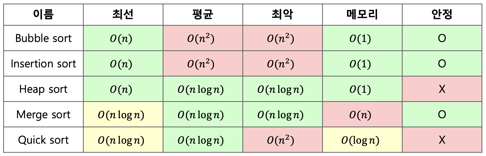

# CS

## 자료구조

선형 자료구조와 비선형 자료구조에 대해 설명해주세요.

- 선형 자료구조: 데이터 요소들이 일렬로 순차적으로 저장되는 구조입니다. 각 요소는 최대 하나의 이전 요소와 하나의 다음 요소를 가집니다. 대표적으로 배열, 연결 리스트, 스택, 큐가 있습니다.
- 비선형 자료구조: 데이터 요소들이 계층적 또는 네트워크 형태로 연결된 구조입니다. 각 요소는 여러 다른 요소와 관계를 맺을 수 있습니다. 대표적으로 트리, 그래프가 있습니다.

값을 추가 및 삭제할 때 logN의 복잡도가 소요되는 자료구조는?

- 균형 이진 탐색 트리 (예: AVL 트리, 레드-블랙 트리): 트리의 높이를 logN으로 유지하여 삽입, 삭제, 검색 연산을 평균 및 최악의 경우 모두 O(log N)으로 수행합니다.
- 힙 (Heap): 완전 이진 트리를 기반으로 하며, 최대/최소값을 삭제하거나 새로운 값을 삽입할 때 O(log N) 시간이 소요됩니다.

연결 리스트와 해시 테이블에 대해서 설명해 주세요.

연결 리스트는 데이터 노드가 포인터(참조)로 연결된 선형 자료구조입니다. 각 노드는 데이터와 다음 노드를 가리키는 포인터를 가집니다. 메모리에 비연속적으로 저장될 수 있으며, 중간 삽입/삭제가 빠릅니다. (O(1) 특정 인덱스를 검색하는 것은 느립니다. (O(n)) 처음부터 순차적으로 탐색해야 하기 때문입니다.

해시 테이블은 키-값 쌍을 저장하며, 해시 함수를 사용하여 키를 배열의 인덱스로 변환하여 데이터에 빠르게 접근하는 자료구조입니다. 삽입, 삭제, 검색이 빠릅니다. (O(1)) JavaSCript의 Object나 Map이 내부적으로 해시 테이블과 유사하게 동작합니다.

해쉬 테이블의 검색 시간 복잡도는 항상 O(1)인가요?

아닙니다. 해시 테이블의 검색 시간 복잡도는 평균적으로 O(1)이지만, 최악의 경우 O(n)이 될 수 있습니다.

- **평균 O(1):** 해시 함수가 키를 고르게 분산시켜 충돌(collision)이 거의 없는 이상적인 경우, 원하는 데이터에 바로 접근할 수 있습니다.
- **최악 O(n):** 모든 데이터가 해시 충돌로 인해 동일한 버킷(bucket)에 저장되는 경우, 해당 버킷 내에서 선형 탐색(linear search)을 해야 하므로 데이터 개수(n)에 비례하는 시간이 걸립니다.

해시 충돌을 해결하는 방법에 대해서 설명해 주세요.

1. 체이닝: 충돌이 발생하면 해당 해시 인덱스에 연결 리스트를 만들어, 충돌하는 데이터들을 이 리스트에 추가하여 저장하는 방식입니다.
2. 개방 주소법: 충돌이 발생하면, 미리 정해진 규칙에 따라 다른 비어있는 인덱스를 찾아 데이터를 저장하는 방식입니다.

좋은 해시 함수의 조건은 뭘까요?

1. 키들을 해시 테이블의 버킷에 최대한 균등하게 분산시켜 해시 충돌을 최소화해야 합니다.
2. 해시 값을 신속하게 계산할 수 있어야 합니다. 해시 함수 자체가 느리면 해시 테이블의 장점이 사라집니다.
3. 동일한 키에 대해서는 항상 동일한 해시 값을 반환해야 합니다.

Stack과 Queue의 차이에 대해 설명해 주세요

[Stack]

- 후입선출(LIFO, Last In First Out)
- 삽입 연산은 Push, 삭제연산은 Pop

예시 : 접시, 브라우저 뒤로 가기, 실행취소(ctrl+z)

[Queue]

- 선입선출(FIFO, First In First Out)
- 삽입 연산은 Enqueue, 삭제연산은 Dequeue

예시 : 은행업무, 놀이기구 대기줄

List, Map, Set의 차이점을 설명해 주세요.

[List]

- 순서와 중복이 있는 자료구조
- 인덱스로 원소에 접근이 가능
- 크기가 가변적

[Map]

- key와 value를 같이 저장할 수 있는 자료구조
- key에 대한 중복이 없으며 순서를 보장하지 않음
- value의 중복은 허용됨
- 검색 속도 빠름

[Set]

- 순서가 없고, 중복된 데이터를 허용하지 않는 자료구조
- 검색 속도 빠름
- 중복되지 않은 데이터를 구할 때 유용

시간복잡도와 공간복잡도에 대해 설명해주세요.

- **시간 복잡도**
  알고리즘을 실행하는 데 걸리는 **시간**이 입력 데이터의 크기에 따라 어떻게 증가하는지를 나타내는 척도입니다. 주로 **Big O 표기법**을 사용하여 표현하며, 알고리즘의 효율성을 평가하는 데 사용됩니다.
- **공간 복잡도**
  알고리즘이 실행되는 동안 사용하는 **메모리 공간**의 양이 입력 데이터의 크기에 따라 어떻게 증가하는지를 나타내는 척도입니다. 역시 **Big O 표기법**을 사용하며, 메모리 사용량의 효율성을 평가합니다.

O(2^n), O(1), O(n^3), O(n!), O(n log n), O(log n), O(n), O(n^2)를 시간복잡도 순서대로 나열해주세요.

1. **O(1)** (상수 시간)
2. **O(log n)** (로그 시간)
3. **O(n)** (선형 시간)
4. **O(n log n)** (로그 선형 시간)
5. **O(n^2)** (이차 시간)
6. **O(n^3)** (삼차 시간)
7. **O(2^n)** (지수 시간)
8. **O(n!)** (팩토리얼 시간)

그래프와 트리의 차이점을 설명해주세요.

- **그래프:** 노드(정점)와 노드 간의 간선으로 이루어진 자료구조입니다. **사이클**이 허용되며, 모든 노드가 연결되어 있지 않아도 됩니다.
- **트리:** 그래프의 한 종류로, **사이클이 없는 연결 그래프**입니다. 일반적으로 **하나의 루트 노드**를 가지며, **계층적인 구조**를 나타냅니다. N개의 노드는 항상 N-1개의 간선을 가집니다.

전위순회 vs 중위순회 vs 후위순회 를 비교해서 설명해주세요.

핵심적인 차이는 루트 노드를 언제 방문하느냐입니다.

- 전위 순회: 루트 → 왼쪽 → 오른쪽
- 중위 순회: 왼쪽 → 루트 → 오른쪽
- 후위 순회: 왼쪽 → 오른쪽 → 루트

Array (배열) vs Linked List (링크드 리스트) 를 비교해서 설명해주세요.

배열은 메모리에 연속적으로 저장되며 인덱스를 통해 빠르게 접근할 수 있어 검색이 O(1)로 매우 효율적이지만, 크기가 고정되고 중간에 삽입이나 삭제 시 요소들을 이동시켜야 해 비용이 큽니다. 이로 인해 삽입과 삭제는 평균적으로 O(n)의 시간이 걸립니다.

반면 링크드 리스트는 각 노드가 포인터를 통해 다음 노드를 가리키는 구조로, 동적으로 크기를 조절할 수 있고 중간 삽입이나 삭제가 포인터만 바꾸면 되기 때문에 O(1)에 가능하지만, 임의 접근이 어려워 검색에는 O(n)의 시간이 필요합니다. 즉, 배열은 빠른 접근이, 링크드 리스트는 유연한 삽입·삭제가 강점입니다.

힙에 대해 설명해주시고, 각 연산의 시간복잡도를 설명해주세요.

- 완전 이진 트리 기반의 자료구조이며, 최대힙과 최소힙이 있다.
- 최댓값, 최솟값 탐색 O(1)
- 삭제 O(log n) → 루트 노드를 삭제 후 마지막 노드를 루트로 가져와서 위치 재구성(heapify)한다.
- 삽입 O(log n) → 마지막 노드에 삽입하고 위치를 재구성(heapify)한다.

AVL트리는 무엇인가요?

이진탐색 트리에서 최악의 경우인 선형 트리가 되는 것을 방지하여, 균형을 잡기 위해 트리 일부를 왼쪽 혹은 오른쪽으로 회전시키는 이진 탐색 트리 (탐색, 삽입, 삭제 모두 시간복잡도 O(log n))

FIFO와 LIFO 형태의 자료구조를 각각 설명해주세요

FIFO(First-In-First-Out)는 먼저 들어온 데이터가 먼저 나가는 구조로, 대표적인 예로 큐(Queue)가 있습니다. 줄을 선 순서대로 처리되는 시스템처럼, 데이터는 한쪽에서 삽입되고 반대쪽에서 제거되며 순서가 중요할 때 유용합니다.

LIFO(Last-In-First-Out)는 나중에 들어온 데이터가 먼저 나가는 구조로, 대표적인 예는 스택(Stack)입니다. 쌓아 올린 책 더미처럼 마지막에 넣은 데이터가 먼저 나가며, 함수 호출 스택이나 되돌리기 기능 등에서 활용됩니다.

1부터 100까지의 정수를 완전 이진트리로 위부터 채운다면 높이는 어떻게 되나요?

높이는 6

루트부터 레벨은 1부터 시작, 높이는 0부터 시작 (높이 = 레벨 - 1)

이진트리란 무엇이고 어떤 종류가 있나요?

자식의 노드 수가 두개 이하인 트리.

- 정이진 트리 → 자식 노드가 0 또는 2개인 이진 트리
- 완전 이진 트리 → 위 계층부터 시작해서 왼쪽에서부터 채워져 있는 이진 트리.
- 변질 이진 트리 → 자식 노드가 하나밖에 없는 이진 트리 (선형처럼 한줄)
- 포화 이진 트리 → 모든 노드가 꽉 차있는 트리
- 균형 이진 트리 → 왼쪽과 오른족 노드의 높이 차가 1이하인 이진 트리.

이진 트리 모양에 값을 채워넣은 것. 왼쪽 하위 트리에는 작은값, 오른쪽 하위 트리에는 큰 값이 들어있음. (탐색 시 보통 O(log n)이지만, 최악에는 O(n))

이진 트리 모양에 값을 채워넣은 것. 왼쪽 하위 트리에는 작은값, 오른쪽 하위 트리에는 큰 값이 들어있음. (탐색 시 보통 O(log n)이지만, 최악에는 O(n))

종류는 AVL 트리, 레드 블랙 트리가 있습니다.

우선순위 큐의 동작, 구현방식에 대해 설명해주세요.

우선순위 큐는 일반 큐와 달리, 삽입된 요소 중 가장 높은 우선순위를 가진 요소가 먼저 나가는 자료구조입니다. 데이터를 단순히 순서대로 처리하는 것이 아니라, 각 요소의 우선순위를 기준으로 정렬하여 처리합니다.

구현 방식으로는 배열, 연결 리스트, 힙이 있으며, 가장 일반적인 방식은 이진 힙(Binary Heap)입니다. 이진 힙을 사용하면 삽입과 삭제 연산이 O(log n)으로 효율적이며, 최소 힙은 최솟값을, 최대 힙은 최댓값을 빠르게 꺼낼 수 있어 우선순위 큐의 성능을 잘 보장합니다.

트리의 구성요소인 노드에서, 어떤 노드들이 있는지 설명해주세요.

- Root Node (루트 노드):: 가장 위에 있는 노드
- Internal Node (내부 노드, 비단말 노드): 루트와 리프 노드 사이에 있는 노드
- Terminal Node (=leaf Node, 단말 노드): 자식 노드가 없는 노드

트리의 레벨과 높이의 차이점은 무엇인가요?

- 루트부터 레벨은 1부터 시작, 높이는 0부터 시작 (높이 = 레벨 - 1)

DFS와 BFS을 비교하고, 각각의 시,공간 복잡도를 설명하세요.

DFS(Depth-First Search)는 한 경로를 끝까지 탐색한 뒤 다른 경로로 이동하는 방식이며, 재귀나 스택을 사용해 구현됩니다. BFS(Breadth-First Search)는 가까운 노드부터 차례로 탐색하는 방식으로, 큐를 사용해 구현되고 최단 경로 탐색에 적합합니다.

두 알고리즘 모두 정점 V개와 간선 E개일 때 시간 복잡도는 O(V + E)로 동일합니다. 공간 복잡도는 DFS가 재귀 호출 또는 스택에 의해 O(V), BFS는 큐에 의해 O(V)의 공간을 사용하지만, BFS는 모든 노드를 한 번에 큐에 담을 수 있어 실제 메모리 사용량은 DFS보다 더 클 수 있습니다.

트라이(Trie) 자료구조에 대해 설명하고 사용 예시에 대해 설명하세요.

Trie는 문자열을 효율적으로 저장하고 검색하기 위한 트리 기반 자료구조입니다. 각 노드는 한 글자를 저장하며, 루트에서 리프까지의 경로가 하나의 문자열을 표현합니다.

트라이 자료구조는 문자열 검색속도가 O(N)입니다. 공통접두사를 공유하여 메모리를 절약하는 것이 특징입니다.

트라이를 사용하는 경우는 자동완성 기능이나 사전구현, 접두사 검색 등에 대해 사용할 수 있습니다.

B-트리와 B+트리에 대해 설명하세요.

---

## 알고리즘

Dynamic Programming에 대해 설명해주세요.

Dynamic Programming(동적 프로그래밍)은 복잡한 문제를 작은 부분 문제로 나누고, 그 결과를 저장해 중복 계산을 피함으로써 전체 문제를 효율적으로 해결하는 기법입니다. 이를 통해 동일한 부분 문제를 반복적으로 계산하지 않고 메모이제이션 또는 테이블 방식으로 재사용합니다.

그리디 알고리즘에 대해 설명해주세요

그리디 알고리즘은 매 순간 가장 최선이라고 판단되는 선택을 하는 방식으로, 전체 문제에 대한 최적해를 구하는 알고리즘입니다. 각 단계에서의 지역적 최적 선택이 전체적으로도 최적의 결과를 보장할 수 있는 문제에 적합합니다.

대표적인 예로는 동전 거스름돈 문제, 크루스칼 알고리즘, 활동 선택 문제 등이 있으며, 구현이 간단하고 빠르지만 항상 최적해를 보장하지는 않기 때문에 적용 가능한 문제인지 판단이 중요합니다.

Kruskal Algorithm(크루스칼 알고리즘)에 대해 설명해주세요.

Kruskal 알고리즘은 최소 신장 트리(MST, Minimum Spanning Tree)를 찾기 위한 그리디 알고리즘으로, 그래프의 모든 간선 중 가중치가 낮은 것부터 선택하면서 사이클이 생기지 않도록 트리를 구성합니다. 이를 위해 간선을 가중치 오름차순으로 정렬한 후, 하나씩 선택하며 서로 다른 집합에 속한 정점을 연결할 때만 추가합니다.

사이클 여부를 판단하기 위해 주로 Union-Find(Disjoint Set) 자료구조를 사용하며, 시간 복잡도는 간선의 개수를 E, 정점의 개수를 V라 할 때 O(E log E)입니다. 연결 요소 간 비용 최소 연결을 찾는 데 유용하며, 간선 중심의 알고리즘이라는 점에서 Prim 알고리즘과 차별됩니다.

Prime Algorithm(프림 알고리즘)에 대해 설명해주세요.

Prim 알고리즘은 최소 신장 트리(MST)를 구하는 그리디 알고리즘으로, 하나의 정점에서 시작해 인접한 간선 중 가중치가 가장 낮은 간선을 선택하며 트리를 확장해 나갑니다. 모든 정점이 포함될 때까지 가장 짧은 연결을 반복적으로 선택하며, 항상 연결된 트리 상태를 유지하는 것이 특징입니다.

우선순위 큐(힙)를 활용하면 효율적으로 구현할 수 있으며, 시간 복잡도는 O(E log V)입니다. Prim은 정점 중심 방식으로, 촘촘한 그래프에서 Kruskal보다 유리한 성능을 보이는 경우가 많습니다.

BFS와 다익스트라의 공통점과 차이점은 뭘까요?

BFS와 다익스트라는 모두 그래프에서 최단 경로를 찾기 위한 알고리즘이며, 큐 또는 우선순위 큐를 이용해 너비 우선으로 노드를 탐색한다는 공통점이 있습니다. 특히 가중치가 모두 동일한 그래프에서는 다익스트라도 BFS처럼 동작하며 최단 거리를 정확히 구할 수 있습니다.

차이점은 가중치 처리 여부에 있으며, BFS는 간선의 가중치가 모두 1일 때만 최단 경로를 보장하지만, 다익스트라는 가중치가 있는 그래프에서도 올바른 최단 경로를 계산합니다. 또한 다익스트라는 각 노드의 최단 거리를 우선순위 큐를 통해 갱신하며 탐색 순서가 동적으로 정해진다는 점에서 BFS보다 계산이 복잡합니다.

다익스트라 알고리즘을 개선한 알고리즘에는 뭐가 있나요?

다익스트라 알고리즘을 개선한 알고리즘 중 대표적인 것은 **벨만-포드 알고리즘**과 **A\* 알고리즘**입니다. 벨만-포드는 음수 가중치가 있는 그래프에서도 최단 경로를 찾을 수 있도록 확장된 방식이며, 사이클 검출 기능도 함께 제공합니다.

A\* 알고리즘은 다익스트라에 **휴리스틱 함수**를 결합해 목표 지점까지의 예상 거리까지 고려하며 탐색 범위를 줄이는 방식으로, 특히 경로 탐색 문제에서 효율성이 뛰어납니다. 또한 다익스트라 자체도 **우선순위 큐(힙)**를 적용해 시간 복잡도를 O((V + E) log V)로 개선할 수 있습니다.

플로이드-워셜 알고리즘에 대해 설명해주세요.

플로이드-워셜 알고리즘은 그래프에서 모든 정점 쌍 간의 최단 경로를 구하는 알고리즘으로, **동적 프로그래밍 기반**으로 동작합니다. 각 정점 쌍 (i, j)에 대해 중간에 거칠 수 있는 정점 k를 하나씩 고려하며, `dist[i][j] = min(dist[i][j], dist[i][k] + dist[k][j])` 방식으로 거리를 점진적으로 갱신합니다.

시간 복잡도는 O(V³)로 느리지만, **음의 가중치 간선**도 허용되며, 간단한 구현으로 모든 경로의 최단 거리를 구할 수 있어 정점 수가 적은 밀집 그래프에 적합합니다. 다만 **음수 사이클이 존재할 경우** 이를 감지할 수는 있지만, 최단 경로 자체는 의미 없게 됩니다.

P / NP / NP-Complete / P=NP? 에 대해 설명해주세요.

| 용어            | 속한 분류                  | 설명                                                   |
| --------------- | -------------------------- | ------------------------------------------------------ |
| **P**           | 결정 문제, 복잡도 클래스   | 다항 시간(Polynomial Time) 안에 "풀 수 있는" 문제 집합 |
| **NP**          | 결정 문제, 복잡도 클래스   | 다항 시간 안에 "검증할 수 있는" 문제 집합              |
| **NP-Complete** | NP 내의 가장 어려운 문제들 | NP 문제 중 모든 다른 NP 문제로 환원 가능한 문제        |
| **P = NP?**     | 복잡도 이론의 대표적 난제  | P와 NP가 같은 집합인지에 대한 미해결 문제              |

Comparisons Sorting와 그 종류에 대해 설명해주세요.

Comparison Sorting은 요소들 간의 **크기 비교**를 통해 정렬 순서를 결정하는 방식의 정렬 알고리즘입니다.

- Bubble Sort (거품 정렬 = 버블 정렬)
  - 인접한 두개의 데이터를 비교하며 정렬해 나가서, 가장 큰 값을 배열의 맨 끝에 이동시켜 뒤부터 채워가는 방식 → O(N^2)
- Selection Sort (선택 정렬)
  - 첫번째부터 끝까지 훑어서 가장 작은걸 첫번째로 놓고, 그 다음으로 두번째부터 끝까지 훌어서 가장 작은걸 두번째로 놓고, 이렇게 끝까지 반복하는 방식. → O(N^2)
- Insertion Sort (삽입 정렬)
  - k번째 원소를 1부터 k-1번째 까지 비교해서 적절한 위치에 끼워 넣고 그 뒤의 값들을 한칸씩 뒤로 밀어내는 방식 → O(N^2)
- Merge Sort (병합 정렬)
  - 2개의 부분 배열로 배열의 길이가 1이 될때까지 반복 분할하고, 그 후 2개의 부분 배열을 다시 합쳐가면서 정렬하면서 모두 합쳐질때까지 반복한다. → O(N log N)
- Heap Sort
  - 트리 기반으로 최소, 최대 힙 트리를 구성해 정렬하는 방식. 내림차순은 최대힙, 오름차순은 최소 힙. → O(N log N)
- Quick Sort
  - 데이터 중에서 임의의 기준인 pivot을 정하여 해당 피벗을 기준으로 두개의 부분집합으로 나눈다. 한쪽에는 피벗보다 작은값을 넣고 반대에는 피벗보다 큰 값을 넣는다. 이를 더이상 쪼갤 부분집합이 없을 때까지 반복 → 평균=O(N log N), 최악=O(N^2)
- Shell Sort
  - 삽입 정렬의 단점을 보완하고자 도입. interval(간격) 만큼 벌어진 원소들을 부분집합으로 구서한 뒤 삽입정렬을 진행하는 방식. 초기 interval 값은 전체 길이 / 2 로 주어지며 계속 2로 나눠주고 반복. → O(N^1.25) OR → O(N^1.5)
- Tim Sort
  - 병합+삽입 정렬로 안정적이며 병합 정렬에 비해 적은 추가 메모리를 사용함. 파이썬에서 정렬 표준.→ O(N log N)

non-Comparisons Sorting와 그 종류에 대해 설명해주세요.

Non-Comparison Sorting은 원소 간의 직접적인 크기 비교 없이 정렬을 수행하는 방식입니다.

- Counting Sort
  - 배열에 존재하는 원소의 개수를 세어서 정렬하는 방식 → O(N)
- Radix Sort (기수 정렬)
  - 정렬하고자 하는 수의 낮은 자리 수를 차례대로 확인하여 정렬하는 방식. 총 10개의 큐를 사용한다. 1의 자리 수 → 10의 자리수 이런식으로 확인. → O(N)

Stable sort & Unstable sort에 대해 설명해주세요.

키 값을 가진 노드들이 정렬하면서 전 후에 순서가 뒤바뀌면 unstable sort 라고 하고, 순서가 안바뀌면 stable sort 라고 한다.

- Stable sort → Bubble sort / Insertion sort / Merge sort
- Unstable sort →Selection sort / Quick sort / Heap sort

Quick Sort의 시간복잡도를 설명해주세요.

Quick Sort의 평균 시간 복잡도는 O(n log n)으로, 분할 정복 방식으로 리스트를 피벗 기준으로 두 부분으로 나누어 정렬을 반복하기 때문에 빠른 성능을 보입니다. 하지만 최악의 경우, 즉 항상 가장 크거나 작은 값을 피벗으로 선택하면 한쪽만 분할되어 **O(n²)**의 시간 복잡도가 발생합니다.

이를 방지하기 위해 일반적으로 **랜덤 피벗 선택**이나 **중간값 기반 피벗** 선택 전략을 사용해 평균적인 성능을 안정적으로 유지하며, 대부분의 경우 빠른 정렬 성능을 보장합니다.

위상 정렬 (Topology Sort)에 대해 설명해주세요.

위상 정렬은 방향 그래프에서 정점들을 **선후 관계에 따라 순서대로 나열**하는 알고리즘으로, 보통 사이클이 없는 방향 그래프(DAG)에서 사용됩니다. 예를 들어 작업 간 의존성이 있는 일정, 컴파일 순서, 과목 이수 조건 등을 순서대로 정렬할 때 활용됩니다.

대표적인 구현 방식으로는 진입 차수가 0인 노드를 큐에 넣고, 해당 노드를 제거하면서 연결된 노드의 진입 차수를 줄이는 **Kahn’s 알고리즘**과, DFS 기반으로 후위 순회를 이용해 순서를 결정하는 방식이 있습니다. 시간 복잡도는 O(V + E)이며, **사이클이 존재하면 위상 정렬이 불가능**하다는 특징이 있습니다.

캐시 교체 알고리즘에 대해 설명해주세요.

캐시는 제한된 리소스를 사용하기 때문에, 저장 공간이 가득 찼을 때 어떤 데이터를 유지하고 어떤 데이터를 제거할지 결정하는 과정이 필요합니다. 이때 캐시 교체 알고리즘이 사용됩니다. 주요 알고리즘에는 다음과 같은 방식이 있습니다.

종류

1. FIFO (First in First Out) - 가장 먼저 캐시에 들어온 데이터를 먼저 제거
2. LRU (Least Recently Used)
   - 가장 오랫동안 사용되지 않은 데이터를 제거
   - 해시맵과 이중 연결 리스트를 활용해서 구현.
   - 시간복잡도 → 조회, 삽입, 삭제 O(1)
3. LFU (Least Frequently Used) - 사용 횟수가 가장 적은 데이터를 제거

소수 판별 방식을 O(N), O(N/2), O(N^0.5) 별로 설명해주세요.

1. O(N) 방식
   - 한 숫자에 대한 소수 판별시 2부터 해당 숫자 바로 전까지의 모든 수로 나눠보고 나머지가 0인지 확인하는 방법.
2. O(N/2) 방식
   - 짝수를 먼저 제외하고 2 이후의 홀수만 검사하여 연산 횟수를 절반으로 줄이는 방법.
3. O(N^0.5) 방식
   - 소수의 약수 중 하나는 반드시 √N 이하에 존재하므로, 2부터 √N까지만 나눠보는 방법으로 최적화.

에라토스테네스의 체에 대해 설명해주세요.

O(n log log n) 방식

하나의 숫자에 대해 소수판별을 위 세가지 방식으로 충분하지만, 이건 특정 범위의 모든 소수의 개수를 구할때 유용. 1부터 N까지의 모든 소수를 찾을 때 사용, 배수들을 반복적으로 제거하여 소수만 남기는 방식.

ex) 100 이하의 소수를 찾으려면 1을 제외하고, 2부터 100의 제곱근인 10까지의 배수를 모두 제거한다.

그리디 vs 백트래킹 vs DP vs 분할 정복 을 비교해서 설명해주세요.

- 그리디 → 각 단계마다 지금 당장 가장 좋은 방법만을 선택하는 방식.
- 백트래킹 → 가능한 모든 경우를 시도하지만, 불가능한 경우는 중간에 포기하는 방식
- DP (동적 계획법) → 큰 문제를 작은 문제로 나누어서 해결하며 중복 계산을 줄이고, 이를 합침
- 분할 정복 (Divdie and conquer) → 작은 문제들을 독립적으로 해결한 후 합침

---

## 데이터베이스

ERD 풀네임과 무엇인지?

Entity-Relationship Diagram으로, 데이터베이스의 구조를 시각적으로 표현한 다이어그램

SQL과 NoSQL의 차이점에 대해 설명해주세요.

SQL은 정해진 스키마를 기반으로 테이블 구조에 데이터를 저장하는 관계형 데이터베이스로, 복잡한 조인과 트랜잭션 처리에 강하며 데이터의 정합성과 구조화가 중요한 시스템에 적합합니다. 대표적으로 MySQL, PostgreSQL, Oracle 등이 있습니다.

반면 NoSQL은 유연한 스키마를 가지며 문서, 키-값, 컬럼, 그래프 등 다양한 형태로 데이터를 저장하는 비관계형 데이터베이스로, 수평 확장성과 빠른 데이터 처리에 강점을 가지며 대규모 분산 시스템이나 비정형 데이터를 다룰 때 적합합니다. MongoDB, Redis, Cassandra 등이 대표적입니다.

쿠키, 로컬 스토리지, 세션 스토리지를 비교해서 설명해주세요.

- 쿠키 → 클라이언트와 서버 간의 데이터를 저장하고 주고받는 방식으로, 보통 인증 정보나 사용자 설정을 유지하는데 사용한다.
- 로컬 스토리지 → 브라우저에 데이터를 영구적으로 저장한다.
- 세션 스토리지 → 브라우저가 닫힐 때마다 데이터가 삭제되는 특징이 있어 일시적인 데이터 저장에 적합하다.

데이터베이스에서 인덱스(Index)에 대해 설명해주세요.

Index란 테이블을 처음부터 끝까지 검색하는 방법인 FTS(Full Table Scan)과는 달리 인덱스를 검색하여 해당 자료의 테이블을 엑세스 하는 방법입니다.

인덱스는 항상 정렬된 상태를 유지하기 때문에 원하는 값을 검색하는데 빠르지만, 새로운 값을 추가하거나 삭제, 수정하는 경우에는 쿼리문 실행 속도가 느려집니다.

즉, 인덱스는 데이터의 저장 성능을 희생하고 그대신 데이터의 검색 속도를 높이는 기능이라 할 수 있습니다.

DBMS가 Index를 어떤 자료구조로 관리하고 있는지 설명해주세요.

Index는 주로 B+Tree 인덱스 자료구조를 사용합니다. 자식 노드가 2개 이상인 B-Tree를 개선시킨 자료구조이며, BTree 리프노드들을 LinkedList로 연결하여 순차 검색을 용이하게 합니다. 해시 테이블보다 나쁜 O(log2N)의 시간복잡도를 갖지만 일반적으로 사용되는 자료구조입니다.

DBMS가 무엇인지 설명해주세요

DBMS(Database Management System)는 데이터를 효율적으로 저장, 관리, 검색할 수 있도록 도와주는 소프트웨어로, 사용자와 데이터베이스 사이의 중개자 역할을 합니다. 이를 통해 데이터의 무결성, 일관성, 보안, 동시성 제어 등을 보장하며, 쿼리 언어(SQL)를 사용해 데이터를 쉽게 다룰 수 있도록 지원합니다.

대표적인 DBMS로는 MySQL, PostgreSQL, Oracle 등이 있으며, 애플리케이션이 직접 파일에 접근하지 않고 DBMS를 통해 데이터를 다루게 함으로써 데이터 관리의 안정성과 효율성을 높입니다.

트랜잭션에 대해 설명해주세요

트랜잭션(Transaction)은 데이터베이스에서 하나의 작업 단위로 처리되는 연산 묶음으로, 모두 성공하거나 모두 실패해야 하는 원자성을 갖습니다. 예를 들어 은행 이체처럼 여러 단계의 작업이 하나의 논리적 작업으로 수행되어야 할 때 사용됩니다.

트랜잭션은 ACID(원자성, 일관성, 고립성, 지속성) 특성을 따라야 하며, 이를 통해 시스템 장애나 동시 접근 상황에서도 데이터의 신뢰성과 일관성을 보장합니다. DBMS는 트랜잭션을 통해 복잡한 데이터 처리 중에도 안전한 처리를 가능하게 합니다.

트랜잭션의 상태는 어떤 것이 있을까요?

트랜잭션의 상태는 일반적으로 **활동(Active)**, **부분 완료(Partially Committed)**, **커밋(Committed)**, **실패(Failed)**, 철회(Aborted)의 다섯 가지로 나뉩니다.

처음 트랜잭션이 시작되면 **활동 상태**가 되며, 연산이 정상적으로 수행되면 **부분 완료** 상태로 넘어갑니다. 이후 커밋 명령이 성공적으로 처리되면 **커밋 상태**로 전환되어 트랜잭션 결과가 영구 반영됩니다. 반면 수행 중 오류가 발생하면 **실패 상태**가 되고, 이때 복구 작업을 통해 이전 상태로 되돌리면 **철회 상태**가 됩니다.

트랜잭션 고립 수준(Isolation Level)에 대해서 간략하게 설명해주세요.

트랜잭션 고립 수준은 트랜잭션에서 일관성 없는 데이터를 허용하도록 하는 수준입니다.

DB는 ACID 특징과 같이 트랜잭션이 독립적인 수행을 하도록 해야하기 때문에, Lockin을 통해 트랜잭션이 DB를 다루는 동안에는 다른 트랜잭션이 관여하지 못하도록 해야합니다.

하지만 무조건적인 Locking으로 수많은 트랜잭션들을 순서대로 처리하게 된다면 DB의 성능은 떨어지게 될 것입니다. 따라서 효율적인 Locking 방법인 고립 수준을 나누어 처리하게 하는 방식이 필요합니다.

교착상태에 대해 설명해주세요.

교착상태(Deadlock)는 둘 이상의 프로세스가 **서로가 점유한 자원을 기다리며 무한 대기 상태에 빠지는 현상**을 말합니다. 이로 인해 각 프로세스는 자신이 필요한 자원을 얻지 못하고, 시스템 전체의 작업 흐름이 멈추게 됩니다.

교착상태가 발생하려면 **상호 배제, 점유와 대기, 비선점, 환형 대기**의 네 가지 조건이 모두 만족해야 하며, 이를 해결하거나 방지하기 위해 **자원 요청 순서 지정, 타임아웃 설정, 교착 상태 탐지 및 회복, 은행가 알고리즘 같은 회피 기법** 등이 사용됩니다.

Inner Join과 Outer Join의 차이에 대해 설명해주세요

**Inner Join**은 두 테이블에서 **조건에 일치하는 교집합 데이터만 조회**하는 방식으로, 공통된 키가 존재하는 경우에만 결과에 포함됩니다. 예를 들어 고객과 주문 테이블을 Inner Join하면, 주문이 있는 고객만 조회됩니다.

반면 **Outer Join**은 조건에 일치하지 않아도 **한쪽 또는 양쪽 테이블의 데이터를 모두 포함**시키는 방식입니다. **Left Outer Join**은 왼쪽 테이블의 모든 데이터를 유지하며 오른쪽에 매칭되는 값이 없으면 NULL을 채우고, **Right Outer Join**은 그 반대, **Full Outer Join**은 양쪽 모두의 데이터를 포함해 조건에 일치하지 않는 부분은 NULL로 채웁니다.

cascade에 대해 설명해주세요

Cascade(카스케이드)는 데이터베이스에서 **부모 테이블의 변경(삭제 또는 수정)이 자식 테이블에 연쇄적으로 영향을 미치도록 설정하는 기능**입니다. 주로 외래 키(Foreign Key) 제약 조건과 함께 사용되어 **데이터 무결성을 자동으로 유지**할 수 있게 해줍니다.

예를 들어 `ON DELETE CASCADE`를 설정하면 부모 테이블의 행이 삭제될 때 **해당 키를 참조하는 자식 테이블의 행도 자동으로 삭제**됩니다. 반대로 `ON UPDATE CASCADE`는 부모 테이블의 키 값이 변경될 경우 **자식 테이블의 외래 키도 함께 수정**됩니다. 이 기능은 수동 정리 없이도 관계형 데이터의 일관성을 유지할 수 있다는 장점이 있지만, **예상치 못한 대량 삭제나 수정이 발생할 수 있어 주의가 필요**합니다.

슈퍼키, 후보키, 대체키, 기본키, 외래키에 대해 설명해주세요.

- Super key : 유일성 O, 최소성 X
- Candidate key : 유일성 O, 최소성 O (키의 집합에서 하나라도 삭제하면 유일성 만족하지 못하는 성질)
- Primary key : 후보 키 중에서 선정된 키. 유일성 O, 최소성 O / Null값 가질수 없다
- Alternate Key : 후보 키에서 기본키를 뺀 모든 후보 키
- Foreign Key : 다른 테이블의 Primary key를 참조하는 컬럼

트리거가 무엇인지 설명해주세요

트리거(Trigger)는 데이터베이스에서 특정 테이블에 데이터 변경 이벤트(INSERT, UPDATE, DELETE)**가 발생했을 때 **자동으로 실행되는 사용자 정의 프로시저\*\*입니다. 개발자가 명시적으로 호출하지 않아도 조건을 만족하면 자동 실행되며, 데이터 무결성 유지나 로그 기록, 관련 테이블 동기화 등에 사용됩니다.

트리거는 **BEFORE 또는 AFTER** 옵션을 통해 이벤트 발생 시점을 지정할 수 있으며, 장점으로는 반복적인 작업 자동화와 데이터 보호가 있지만, **복잡한 로직은 성능 저하와 디버깅 어려움**을 초래할 수 있어 신중하게 설계해야 합니다.

정규화에 대해 설명해주세요

데이터베이스 설계 과정에서 데이터 중복을 최소화하고, 무결성을 보장하기 위해 테이블을 분리하는 과정입니다. 이를 통해데이터 일관성을 유지하고, 삽입/갱신/삭제 이상을 방지할 수 있습니다.

- 데이터 중복 최소화 → 저장 공간 절약
- 데이터 무결성 보장 → 데이터의 일관성 유지
- 삽입·갱신·삭제 이상 방지 → 비정상적인 데이터 조작 방지
- 데이터 모델 유지보수 용이 → 변경이 있어도 구조적으로 안정적
- 정규화의 단계
  - 정규화는 1NF → 2NF → 3NF → BCNF → 4NF → 5NF 순으로 진행되며, 일반적으로 3NF 또는 BCNF까지만 적용하는 경우가 많습니다.

무결성이 무엇인가요?

무결성(Integrity)은 데이터가 **정확하고 일관되며, 인가되지 않은 방식으로 변경되지 않았음을 보장하는 성질**을 말합니다. 주로 데이터베이스나 시스템 보안에서 사용되며, 정보가 손상되거나 오류 없이 **신뢰할 수 있는 상태로 유지되는 것**이 핵심입니다.

예를 들어, 데이터베이스에서는 **참조 무결성, 엔티티 무결성, 도메인 무결성** 같은 제약 조건을 통해 잘못된 데이터 입력이나 갱신을 방지하고, 시스템에서는 해시값이나 접근 제어를 통해 데이터의 무단 변경을 막아 무결성을 보장합니다.

정규화의 목적과 단계를 설명해주세요.

- 정규화의 목적
  - 데이터 중복 최소화 → 저장 공간 절약
  - 데이터 무결성 보장 → 데이터의 일관성 유지
  - 삽입·갱신·삭제 이상 방지 → 비정상적인 데이터 조작 방지
  - 데이터 모델 유지보수 용이 → 변경이 있어도 구조적으로 안정적
- 정규화의 단계
  - 정규화는 1NF → 2NF → 3NF → BCNF → 4NF → 5NF 순으로 진행되며, 일반적으로 3NF 또는 BCNF까지만 적용하는 경우가 많습니다.

이상현상에 대해 설명해주세요

이상현상(Anomaly)은 데이터베이스에서 **테이블 설계가 비정규화되어 있을 때 발생하는 데이터 불일치나 비효율적인 처리 문제**를 의미하며, 주로 삽입 이상, 삭제 이상, 갱신 이상 세 가지로 나뉩니다.

**삽입 이상**은 불필요한 정보를 함께 입력해야만 원하는 데이터를 저장할 수 있는 문제이고, **삭제 이상**은 특정 데이터를 삭제할 때 관련 없는 정보까지 함께 사라지는 문제입니다. **갱신 이상**은 동일한 데이터가 여러 곳에 중복되어 있을 때, 일부만 수정되어 데이터 불일치가 발생하는 문제를 말합니다. 이를 해결하기 위해 정규화를 통해 테이블을 구조적으로 분해하고, 데이터의 중복과 종속성을 줄이는 작업이 필요합니다.

NoSQL의 장단점은?

**NoSQL**의 장점은 먼저 **유연한 스키마** 구조로, 정해진 테이블 없이 다양한 형태의 데이터를 자유롭게 저장할 수 있어 **비정형 또는 반정형 데이터 처리에 유리**합니다. 또한 수평 확장이 쉬워 대용량 데이터를 다루는 데 적합하고, 성능이 뛰어나 **빠른 읽기·쓰기 처리**가 가능합니다.

단점으로는 **복잡한 관계 표현이 어렵고 조인이 제한적**이며, 데이터 정합성이나 트랜잭션 처리에서 **RDBMS에 비해 약한 일관성 모델**을 사용하는 경우가 많습니다. 따라서 데이터 구조가 자주 바뀌거나 확장이 필요한 시스템에는 적합하지만, **정합성이 중요한 금융 등에서는 부적합할 수 있습니다.**

Statement vs PreparedStatement 를 비교해주세요.

- Statement는 실행할 때마다 SQL을 컴파일하므로 반복 실행 시 성능이 떨어지고, SQL Injection 공격에 취약하다.
- PreparedStatement: 미리 SQL을 컴파일 한 후 파라미터를 바인딩하여 실행하므로 재사용성이 높고, 보안상 SQL Injection을 방지할 수 있다.

---

## 운영체제

운영체제란 무엇인가요?

프로그램들에게 자원을 할당해주고 올바르게 실행되도록 돕는 프로그램. 운영체제도 프로그램이기 때문에 실행되기 위해서 메모리에 저장되어 있어야하고, 메모리의 커널 영역에 적재되어 있다. 웹브라우저, 게임, 메모장 같은 일반적인 응용 프로그램들은 사용자 영역에 적재된다.

운영체제를 알아야 하는 이유가 뭘까요?

운영체제는 프로그램을 위한 프로그램이다. 그러므로 프로그램을 만드는 개발자는 운영체제를 알아야한다.

우리가 만드는 프로그램은 운영체제한테 도움을 받아서 실행되고, 문제가 발생하면 운영체제가 가장 먼저 알아챈다. 그러므로 프로그램을 위한 근원적인 프로그램인 운영체제를 잘 알아야 한다.

CPU나 메모리 같은 하드웨어들은 문제가 생기면 동작 안하고 끝이다. 하지만 운영체제는 프로그램이기 때문에 오류 메세지를 통해 대화할 수 있다.

뮤텍스와 세마포어의 차이

- **뮤텍스** : 한 번에 하나의 스레드만 접근 가능한 잠금 메커니즘. 소유권 개념이 있어 잠금을 획득한 스레드만 해제할 수 있다. 이진(0 또는 1) 상태만 가지게된다.
- **세마포** : 여러 스레드가 접근할 수 있는 카운터 기반 동기화 메커니즘. 소유권 개념이 없어 다른 스레드가 세마포를 해제할 수 있고, 여러 개의 자원을 관리할 수 있다.

메모리 할당방식의 여러 방식들에 대해 설명해주세요

### 연속 할당 (Contiguous Allocation)

- **고정 분할 (Fixed Partition)**:
  - 메모리를 미리 고정된 크기의 파티션으로 나누어 할당
  - 내부 단편화(Internal Fragmentation) 발생
- **가변 분할 (Variable Partition)**:
  - 프로세스 크기에 맞게 필요한 만큼만 동적으로 할당
  - 외부 단편화(External Fragmentation) 발생

### 비연속 할당 (Non-contiguous Allocation)

- **페이징 (Paging)**:
  - 물리 메모리는 고정 크기의 프레임으로, 논리 메모리는 페이지로 분할
  - 페이지 테이블로 주소 변환 관리
  - 내부 단편화 발생
- **세그멘테이션 (Segmentation)**:
  - 프로그램의 논리적 단위(코드, 데이터, 스택 등)별로 분할
  - 세그먼트 테이블로 주소 변환
  - 외부 단편화 발생
- **페이지드 세그멘테이션 (Paged Segmentation)**:
  - 세그먼트를 페이지 단위로 나누어 관리
  - 두 방식의 장점 결합

프로세스와 스레드의 차이에 대해 설명해 주세요.

- Process : 운영체제로부터 자원을 할당받은 작업의 단위
- Thread : 프로세스가 할당받은 자원을 이용하는 실행 흐름의 단위

하나의 프로세스에서 스레드들은 각각 stack영역만 따로 할당받고 code, data, heap영역은 공유합니다.

멀티 프로세스와 멀티 스레드의 차이에 대해 설명해 주세요.

Multi-Process : 하나의 프로그램을 여러 개의 프로세스로 구성하여 각 프로세스가 하나의 작업(task)을 처리하는 것

- 장점 : 하나의 자식 프로세스에서 문제가 발생해도 영향이 전파되지 않음
- 단점 : 잦은 Context Switching으로 인한 오버헤드가 발생할 수 있고, 프로세스 사이 통신이 어려움(IPC)

Multi-Thread : 프로그램을 여러 개의 스레드로 구성하고 각 스레드가 하나의 작업(task)을 처리하는 것

- 장점 : 시스템 자원 효율성 증가, 처리 비용 감소, 자원 공유
- 단점 : 하나의 스레드에 문제가 생기면 전체 프로세스에 영향이 감, 자원 공유로 인한 동기화 문제, 디버깅이 까다로움

내부단편화와 외부단편화 차이에 대해 설명해주세요

내부 단편화는 메모리를 고정 크기로 분할할 때, 실제 사용되는 공간보다 큰 블록이 할당되어 **남는 공간이 블록 내부에 낭비**되는 현상을 말합니다. 예를 들어 100KB짜리 블록에 70KB만 사용하는 경우, 남은 30KB는 내부 단편화로 간주됩니다.

반면 외부 단편화는 가변 크기 메모리 할당 시, **사용하지 못하는 작은 빈 공간들이 메모리 곳곳에 흩어져** 전체 사용 가능한 메모리는 충분해도 큰 블록을 할당하지 못하는 현상입니다. 이는 메모리의 연속성 부족에서 발생하며, 압축(compaction) 등의 방식으로 해결하기도 합니다.

데드락에 대해 설명해주세요

데드락(Deadlock)은 둘 이상의 프로세스가 서로가 가진 자원을 점유한 채 **서로의 자원이 풀리기만을 기다리며 무한 대기 상태에 빠지는 현상**을 말합니다. 이로 인해 해당 프로세스들은 더 이상 진행되지 않고, 시스템 전체의 자원 흐름이 멈추게 됩니다.

데드락이 발생하려면 **상호 배제, 점유와 대기, 비선점, 환형 대기**라는 네 가지 조건이 모두 만족해야 하며, 이를 방지하거나 해결하기 위해 자원 순서 고정, 타임아웃, 교착 회피 알고리즘(예: 은행가 알고리즘) 등을 사용합니다.

데드락의 4가지 조건과 해결 방법에 대해 설명해주세요

데드락이 발생하기 위해서는 다음의 **4가지 조건**이 모두 만족되어야 합니다.

1. **상호 배제(Mutual Exclusion)**: 자원은 동시에 하나의 프로세스만 사용할 수 있어야 합니다.
2. **점유와 대기(Hold and Wait)**: 자원을 점유한 상태에서 다른 자원을 기다리는 프로세스가 있어야 합니다.
3. **비선점(No Preemption)**: 다른 프로세스가 점유 중인 자원을 강제로 빼앗을 수 없어야 합니다.
4. **환형 대기(Circular Wait)**: 프로세스들이 자원을 순환적으로 기다리는 형태여야 합니다.

해결 방법으로는 조건 중 하나 이상을 **사전에 제거하거나 회피**하는 방식이 있습니다. 예를 들어 자원 요청 순서를 고정해 **환형 대기**를 방지하거나, **은행가 알고리즘**처럼 안전 상태만 허용해 **교착 상태를 회피**할 수 있습니다. 또한 **타임아웃**, **자원 선점**, **교착 상태 탐지 및 복구** 같은 실행 중 대응 방식도 사용됩니다.

페이징 알고리즘에 대해 아는대로 설명해주세요

페이징 알고리즘은 메모리 관리에서 페이지 교체가 필요할 때 **어떤 페이지를 제거할지 결정하는 방식**으로, 제한된 물리 메모리를 효율적으로 사용하는 데 목적이 있습니다. 프로세스가 필요한 페이지가 메모리에 없을 경우 페이지 부재(Page Fault)가 발생하며, 이때 적절한 페이지를 제거하고 새로운 페이지를 적재해야 합니다.

대표적인 페이징 알고리즘에는 **FIFO(선입선출)**, **LRU(Least Recently Used)**, **Optimal(최적)**, **LFU(Least Frequently Used)** 등이 있으며, 각각 교체 기준이 다릅니다. 예를 들어 LRU는 가장 오랫동안 사용되지 않은 페이지를 제거하고, Optimal은 앞으로 가장 오랫동안 사용되지 않을 페이지를 제거하지만 실제 구현은 어렵습니다. 이 알고리즘들은 페이지 부재율을 낮추고 메모리 사용 효율을 높이는 것이 핵심입니다.

스케쥴 알고리즘에 대해 아는대로 설명해주세요

스케줄링 알고리즘은 CPU와 같은 시스템 자원을 여러 프로세스에 **공정하고 효율적으로 분배**하기 위한 정책으로, 운영체제의 핵심 기능 중 하나입니다. 프로세스 상태, 우선순위, 실행 시간 등을 고려해 어떤 프로세스를 언제 실행할지를 결정합니다.

대표적인 알고리즘으로는 **FCFS(First Come First Serve)**, **SJF(Shortest Job First)**, **Priority Scheduling**, **Round Robin**, **MLFQ(Multi-Level Feedback Queue)** 등이 있습니다. FCFS는 단순하지만 긴 대기시간이 발생할 수 있고, SJF는 평균 대기시간이 짧지만 실행 시간 예측이 어렵습니다. Round Robin은 시분할 방식으로 공정성을 보장하며, MLFQ는 우선순위와 시간 할당을 조절해 다양한 작업에 유연하게 대응합니다.

starvation과 convoy effect의 차이에 대해 설명해주세요

Starvation(기아 현상)은 우선순위가 낮은 프로세스가 자원을 장기간 할당받지 못해 **영구적으로 실행되지 않는 상태**를 말합니다. 이는 우선순위 기반 스케줄링에서 높은 우선순위 작업이 계속 들어올 경우 낮은 우선순위 작업이 계속 밀려 발생합니다.

반면 Convoy Effect(호위 효과)는 하나의 긴 작업이 자원을 점유한 동안, **짧은 작업들이 줄줄이 대기하며 전체 시스템 효율이 저하되는 현상**입니다. 이는 주로 FCFS 같은 선입선출 스케줄링에서 발생하며, 한 작업이 끝날 때까지 나머지들이 묶여 기다리는 구조적 병목이 원인입니다.

캐시히트와 캐시미스에 대해 설명해주세요

캐시 히트(Cache Hit)는 CPU가 요청한 데이터가 캐시에 존재하여 **메모리에 접근하지 않고 빠르게 처리되는 경우**를 의미합니다. 이때 캐시의 장점인 속도 향상이 극대화되며, 시스템 성능이 향상됩니다.

반면 캐시 미스(Cache Miss)는 요청한 데이터가 캐시에 없어서 **하위 메모리 계층(예: RAM 또는 디스크)에서 데이터를 가져와야 하는 경우**로, 접근 시간이 길어져 성능 저하가 발생합니다. 캐시 미스는 종류에 따라 **컴펄서리(초기 접근), 캐패시티(캐시 용량 부족), 컨플릭트(충돌)** 미스로 나뉘며, 캐시 효율을 높이기 위해 교체 정책이나 캐시 크기 조정 등이 필요합니다.

프로세스 동기화란 뭔가요?

프로세스 동기화는 둘 이상의 프로세스나 스레드가 **공유 자원에 동시에 접근할 때 발생할 수 있는 충돌을 방지하고, 올바른 실행 순서를 보장**하기 위한 제어 기법입니다. 주로 임계 구역(Critical Section) 문제를 해결하기 위해 사용되며, 동기화를 통해 데이터의 일관성과 정확성을 유지합니다.

이를 위해 **뮤텍스(Mutex), 세마포어(Semaphore), 모니터(Monitor)** 등의 동기화 도구가 사용되며, 잘못된 동기화는 교착 상태나 무한 대기 등의 문제를 유발할 수 있어, 적절한 설계와 구현이 매우 중요합니다.

busy waiting에 대해 설명해주세요

Busy Waiting은 프로세스가 원하는 자원을 얻기 위해 **계속해서 반복문을 돌며 상태를 확인하는 방식**으로, 자원을 얻을 때까지 CPU를 점유한 채 대기하는 상태를 말합니다. 예를 들어, 공유 자원이 사용 중일 때 잠금이 풀릴 때까지 무한 루프를 도는 상황이 이에 해당합니다.

이 방식은 구현이 단순하고 빠르지만, **CPU 자원을 낭비**하므로 효율이 낮고, 다른 프로세스의 실행을 방해할 수 있습니다. 따라서 운영체제나 동기화 메커니즘에서는 보통 Busy Waiting 대신 **블로킹 기반 대기 방식**을 선호합니다.

바이너리 세마포어와 뮤텍스의 차이는?

### 바이너리 세마포어와 카운팅 세마포어의의 차이는?

**바이너리 세마포어**와 **카운팅 세마포어**는 기본 구조는 같지만, **카운터 값의 범위와 용도**에서 차이가 있습니다.

**바이너리 세마포어**는 값이 **0 또는 1**만 가질 수 있어, **단일 자원 제어** 또는 **스레드 간 신호 전달**에 사용됩니다. 마치 뮤텍스처럼 하나의 자원에 대한 접근을 제어할 수 있지만, 소유권이 없기 때문에 어떤 스레드든 해제(signal)할 수 있다는 점이 다릅니다.

반면 **카운팅 세마포어**는 **0 이상의 정수** 값을 가지며, **여러 자원에 대한 접근을 동시에 관리**할 수 있습니다. 예를 들어, 자원이 3개라면 초기값을 3으로 두고, 동시에 최대 3개의 스레드가 접근 가능하도록 제어할 수 있습니다.

요약하자면, **바이너리 세마포어는 단일 자원용**, **카운팅 세마포어는 다중 자원용**, 그리고 바이너리는 뮤텍스와 비슷하지만 **소유권 없이 더 유연**하다는 특징이 있습니다.

(카운팅)세마포어와 뮤텍스의 차이는?

1. Mutex는 동기화 대상이 오직 1개일 때 사용하며, Semaphore는 동기화 대상이 1개 이상일 때 사용합니다.
2. Mutex는 자원을 소유할 수 있고, 책임을 가지는 반면 Semaphore는 자원 소유가 불가합니다.
3. Mutex는 상태가 0, 1 뿐이므로 Lock을 가질 수 있고, 소유하고 있는 스레드만이 이 Mutex를 해제할 수 있습니다. 반면 Semaphore는 Semaphore를 소유하지 않는 스레드가 Semaphore를 해제할 수 있습니다.
4. Semaphore는 시스템 범위에 걸쳐 있고, 파일 시스템 상의 파일로 존재합니다. 반면, Mutex는 프로세스의 범위를 가지며 프로세스 종료될 때 자동으로 Clean up 됩니다.

바이너리 세마포어와 뮤텍스의 차이는?

1. Mutex는 동기화 대상이 오직 1개일 때 사용하며, **Binary Semaphore도 마찬가지로 1개의 자원에 사용되지만, 주로 스레드 간 신호 전달 용도로 사용됩니다.**
2. Mutex는 자원을 소유할 수 있고, 책임을 가지는 반면 **Binary Semaphore는 자원 소유 개념이 없으며**, 소유하지 않은 스레드도 해제할 수 있습니다.
3. Mutex는 상태가 0, 1 뿐이므로 Lock을 가질 수 있고, **락을 소유한 스레드만이 이 Mutex를 해제할 수 있습니다.** 반면 Binary Semaphore는 소유권이 없어 **다른 스레드가 해제(signal)할 수 있습니다.**
4. Binary Semaphore는 시스템 범위에 걸쳐 있고, 파일 시스템 상의 파일로 존재합니다. 반면, Mutex는 프로세스의 범위를 가지며 프로세스 종료될 때 자동으로 Clean up 됩니다.

가상 메모리 (Virtual Memory)에 대해 설명해 주세요.

Multi-Process : 하나의 프로그램을 여러 개의 프로세스로 구성하여 각 프로세스가 하나의 작업(task)을 처리하는 것

- 장점 : 하나의 자식 프로세스에서 문제가 발생해도 영향이 전파되지 않음
- 단점 : 잦은 Context Switching으로 인한 오버헤드가 발생할 수 있고, 프로세스 사이 통신이 어려움(IPC)

Multi-Thread : 프로그램을 여러 개의 스레드로 구성하고 각 스레드가 하나의 작업(task)을 처리하는 것

- 장점 : 시스템 자원 효율성 증가, 처리 비용 감소, 자원 공유
- 단점 : 하나의 스레드에 문제가 생기면 전체 프로세스에 영향이 감, 자원 공유로 인한 동기화 문제, 디버깅이 까다로움

프로세스의 상태전이를 설명해주세요.

- New → Ready: 프로세스 생성 후 준비 상태로 전이
- Ready → Running: CPU 스케줄러에 의해 선택되어 실행
- Running → Ready: 타임 슬라이스 종료나 선점으로 인해 다시 준비 상태로
- Running → Waiting: I/O 요청이나 이벤트 대기로 인해 대기 상태로
- Waiting → Ready: I/O 완료나 이벤트 발생 후 다시 준비 상태로
- Running → Terminated: 프로세스 실행 완료

메모리 관리 전략에 대해 설명해주세요.

운영체제는 효율적인 메모리 관리를 위해 페이징, 세그먼테이션 등을 사용한다.

1. 페이징
   - 고정된 크기의 블록으로 메모리를 관리하여 단편화를 줄인다.
   - 페이지 단위로 분할되어 할당되기 때문에 물리 메모리 내에 작은 공간이 남더라도 이를 페이지 크기로 합쳐 큰 공간으로 사용할 수 있기 때문에 외부 단편화 해결
2. 세그멘테이션
   - 논리적 단위로 분할하여 메모리 활용도를 높인다.
   - 프로세스의 크기가 동적으로 변하는 경우에 효율적으로 메모리를 할당 할 수 있어 내부 단편화 해결

캐시에 대해 설명해주세요.

캐시는 자주 사용하는 데이터를 빠르게 접근하기 위해 사용됩니다. CPU는 캐시 적중률을 높이기 위해 지역성을 기반으로 캐시 메모리에 어떤 데이터를 저장할지 결정한다. (캐시 적중률 = 캐시 적중 횟수 / 전체 메모리 접근 횟수)

캐시와 CDN은 어떤 차이가 있나요?

목적과 동작 방식에서 차이가 있습니다. 캐시는 자주 사용되는 데이터를 임시 저장하여 재사용성을 극대화하고, 반복적인 요청 시 빠르게 반환.하는 방식입니다. CDN은 사용자와 가까운 서버(엣지 서버)에서 데이터를 제공하여 네트워크 지연을 줄이고 로딩 속도를 최적화하는 방식입니다

context switching (문맥 교환)에 대해 설명해주세요.

현재 실행 중인 프로세스의 상태를 저장하고, 다음 실행할 프로세스의 상태를 복원하는 작업

이를 통해 CPU는 하나의 프로세스만 독점하지 않고, 여러 프로세스를 공정하게 실행할 수 있다.

---

## 네트워크

HTTP란 무엇인가요?

답변

**HTTP는 HyperTextTransferProtocol의 줄임말로 웹상에서 HyperText즉, HTML파일 같은 리소스를 주고받는 프로토콜입니다.**

여담1) HyperText는 말 그대로 Text를 초월한 Text입니다. 단순한 글자 이상의 기능을하는 글자를 의미합니다. 예를들면 하이퍼링크같이 글자에 링크를 다는 것 같은 시각적으로 읽는것 외에도 추가적인 기능을 가진 글자를 의미합니다.

여담2) HTML은 HyperTextMarkupLanguage입니다. HyperText는 위에서 설명했고, Markup에 대해서 알아봅시다. (Mark-up이아니라 Markup이 하나의 단어입니다) markup은 문서의 내용(문자)외에 문서의 서식,구조등을 표현하기 위한 정보를 말합니다. 태그를 이용해 문서의 구조를 표현하고, 이를 마치 언어처럼 사용해서 markup langague라고 부릅니다.

정리) 마크업 언어는 문서의 구조를 표현하기 위한 언어이다.

여담3) 프로토콜에 대해 알아봅시다. 프로토콜의 용어 자체는 ‘통신 장비 사이에 메세지를 주고받는 양식 혹은 규칙’이라고 표현합니다. 흔히 전공책으로 본, ‘Computer Network - Topdown approach’에선 syntax,sementics,timing 세가지 단어로 설명하고 있습니다.

- Syntax(문법) : 데이터의 구조나 형식
- Sementic(의미): 형식의 담긴 데이터를 어떻게 해석할지
- Timing (타이밍) : 형식에 맞춘 의미를 담은 데이터가 어떤 순서로 오가야할지

이렇게 세가지 단어를 통해 프로토콜을 정의하고 있습니다.

HTTP의 특징

HTTP는 클라이언트-서버구조로 되어있고, 서버가 클라이언트의 상태를 저장하지 않는 무상태 프로토콜입니다. 또한, 요청을 주고받을 때만 연결을 유지하고 응답 이후 연결이 끊어지는 비연결성을 갖고 있습니다.

HTTP 버전의 발전 단계

- HTTP 0.9초기모델인 HTTP 0.9는 GET메서드만 지원을 해주었고 HTTP 헤더조차 없었습니다.
- HTTP 1.0HTTP 1.0에서는 모든 메서드를 지원하고, 헤더도 추가되었습니다. 또한, 한번의 데이터 전송을 위해 연결과 해제를 해야하는 비효율적인 구조입니다.
- HTTP 1.1이를 해결하기 위해 HTTP 1.1에서는 keep-alive속성이 헤더에 추가되어 지속적인 연결이 가능해졌습니다. 그래서 여러번의 데이터 전송을 하더라도, 한번의 연결과 한번의 해제만 있으면 됩니다.
- HTTP 2.0HTTP 2.0에서는 이전버전의 HOL(Head Of Line Blocking)문제: 무거운 헤더로 인해 이후의 패킷이 영향을 받는 문제를 해결하기 위해 멀티플렉싱을 지원하여 단일 TCP연결에도 여러 요청과 응답을 받을 수 있게 되었습니다. 또한, 헤더압축도 지원합니다.
- HTTP 3.0HTTP 2.0의 긴 왕복지연시간(RTT)을 해결하기 위해 TCP기반을 UDP기반으로 바꾸어 지연시간을 3-RTT에서 1-RTT로 줄였습니다.

HTTPS와 HTTP의 차이

HTTP와 HTTPS는 웹에서 데이터를 주고받는 프로토콜이지만, 보안 측면에서 차이가 있습니다.

HTTPS는 HTTP에 SSL/TLS 프로토콜을 추가하여 보안이 강화된 프로토콜입니다. 따라서, HTTPS의 경우 모든 데이터가 암호화되어 전송됩니다.

또한, 기본 포트번호도 HTTP의 경우는 80, HTTPS의 경우는 443입니다.

HTTP의 멱등성

HTTP 멱등성(idempotent)이란 하나의 요청이 아닌 여러번 동일한 요청을 보냈을 때 서버가 같은 상태를 가지는 것을 멱등성이라고 합니다. 따라서 GET, PUT, DELETE와 같은 메서드는 멱등성을 갖고, POST나 PATCH의 경우는 멱등성을 갖지 않습니다.

PUT과 PATCH의 차이

PUT의 경우 업데이트를 할 때 전체의 데이터를 보내야하고, 데이터가 없다면 데이터를 생성합니다.

PATCH의 경우 업데이트를 할 때 원하는 데이터만 보내도 됩니다.

HTTP의 상태 코드

- 100 : 서버가 요청을 잘 받았고, 해당 프로세스를 계속 이어가라는 코드
- 200 : 요청 성공
- 201 : 요청 성공 및 새로운 데이터 생성
- 301 : 요청한 리소스의 URI가 변경되었음을 의미
- 400 : 서버가 클라이언트의 요청을 이해할 수 없음
- 401 : 클라이언트 인증 문제
- 404 : 요청받은 컨텐츠를 찾을 수 없음
- 500 : 서버 오류
- 502 : 게이트웨이 또는 프록시서버 오류
- 504 : Timeout 시간동안 클라이언트의 요청을 처리하지 못함

DNS의 역할과 동작 원리에 대해 설명

DNS(Domain Name System)는 도메인 네임을 IP 주소로 변환하는 시스템입니다.

DNS는 먼저 브라우저 캐시, 로컬 캐시, 로컬 DNS 서버 순으로 IP주소를 가져옵니다. 만약 캐싱된 정보가 없다면, 루트 네임 서버에 TLD(Top-Level Domain) 네임 서버의 주소를 요청합니다.

이를 통해, 원하는 주소에 대한 **네임서버 주소**를 얻을 수 있습니다.

TLD를 통해 알아낸 **권한 네임 서버**에 최종적으로 실제 주소의 IP주소를 반환받습니다.

여기서 받은 IP주소는 캐싱하여 저장합니다.

웹 소켓이란 무엇이며, 어떻게 작동하는지

**웹 소켓(WebSocket)**은 서버와 클라이언트 간의 양방향, 실시간 통신을 가능하게 하는 프로토콜입니다.

웹소켓은 클라이언트가 서버로 웹소켓 핸드쉐이크를 요청합니다. 서버가 연결을 수락하게 되면, 기존 HTTP 연결을 웹소켓으로 전환됩니다.

CDN은 무엇인가요?

CDN(Content Delivery Network)은 웹 콘텐츠(HTML, CSS, JavaScript, 이미지, 동영상 등)를 사용자와 가까운 서버에서 제공하여 로딩 속도를 최적화하는 분산 네트워크 시스템입니다.

TCP와 UDP의 차이

TCP와 UDP는 둘다 OSI 7계층 중 전송계층에 해당하는 프로토콜입니다.

TCP는 가상회선(Virtual Circuit)을 사용하고 UDP는 데이터그램(Datagram)방식을 사용합니다.

### 가상회선 방식

가상회선 방식의 경우 초기 연결 설정이 필요합니다.

각각의 패킷은 독립적이지 않아서 고장난 링크나 노드를 만나면 새로운 연결을 설정해야 하는 stateful방식입니다.

### 데이터그램 방식

데이터그램 방식의 경우 초기 연결 설정을 하지 않습니다.

또한, 각각의 패킷은 독립적으로 포워드하기 때문에 보낸순서와 받는순서가 다를 수 있습니다.

포워딩 과정 중 고장난 링크나 노드를 우회하여 라우팅을 하는 stateless방식이지만 인터넷의 경우 라우팅 테이블에 timeout(TTL)을 두어 stateful과 stateless가 공존하는 soft state상태입니다.

### 차이 정리

위와같은 차이를 통해 TCP는 신뢰성이 높고, UDP는 신뢰성이 낮습니다.

즉, TCP는 패킷의 순서가 보장되지만 UDP는 보장되지 않아 쓰임이 다릅니다. 속도 측면에서도 TCP는 느리고 UDP는 빠릅니다. 또한, UDP는 브로드캐스트도 지원합니다.

UDP vs QUIC

UDP는 연결 설정 없이 데이터를 빠르게 전송할 수 있는 단순한 전송 프로토콜로, 지연이 적고 오버헤드가 작지만 신뢰성 보장, 순서 보장, 혼잡 제어 등의 기능은 제공하지 않습니다. 이 때문에 실시간 스트리밍이나 게임 등 지연에 민감한 서비스에서 자주 사용됩니다.

QUIC은 UDP 위에서 동작하면서 TCP의 신뢰성, TLS 기반의 보안, 멀티플렉싱, 연결 이관 등의 기능을 결합한 신형 전송 프로토콜입니다. 빠른 연결 수립과 지연 최소화를 통해 HTTP/3의 기반이 되며, 전송 계층과 암호화 계층을 통합해 성능과 보안을 동시에 강화합니다.

OSI 7계층과 TCP/IP 4계층에 대해 설명해주세요.

- OSI 7계층
  - 응용 계층 (Application): 최종 사용자와 직접 연결 (HTTP, FTP, DNS)
  - 표현 계층 (Presentation): 데이터 인코딩/디코딩 (암호화, 압축)
  - 세션 계층 (Session): 연결 관리 (소켓)
  - 전송 계층 (Transport): 신뢰성 있는 데이터 전송 (TCP, UDP)
  - 네트워크 계층 (Network): IP 주소 기반 패킷 라우팅 (IP, 라우터)
  - 데이터 링크 계층 (Data Link): MAC 주소 기반 통신 (이더넷, 스위치)
  - 물리 계층 (Physical): 전기적 신호, 비트 전송 (LAN 케이블, 광섬유)
- TCP/IP 4계층
  - 응용 계층 (세션 + 표현 + 응용 계층)
  - 전송 계층 (전송 계층, TCP/UDP)
  - 인터넷 계층 (네트워크 계층)
  - 네트워크 인터페이스 계층 (물리 + 데이터 링크)

TCP의 3-way handshake와 4-way handshake

TCP의 연결과정과 해제과정은 각각 3-way handshake, 4-way handshake 과정을 겪습니다.

### 3-way handshake과정

클라이언트가 서버로 SYN를 보내 연결을 요청하고 서버에서 클라이언트로 SYN + ACK를 보냅니다. 이를 클라이언트에서 수신받으면 서버로 ACK를 보내며 TCP가 연결됩니다.

### 4-way handshake과정

클라이언트가 연결을 해제하기 위해 FIN요청을 보냅니다. 서버는 이를 받아 ACK를 보내고 남은 요청들을 처리 후 FIN을 클라이언트에게 보냅니다. 클라이언트가 이를 수신하여 ACK를 서버에게 보내고, 혹시나 지연된 데이터응답이 있을 수 있기에 일정시간 기다린 후 연결을 종료합니다.

TCP의 연결 설정 과정(3단계)과 연결 종료 과정(4단계)이 단계가 차이나는 이유는?

TCP의 연결 설정은 신뢰성을 확보하기 위해 클라이언트와 서버가 서로 송수신 가능 상태임을 확인하는 3-way handshake 방식으로 충분하지만, 연결 종료는 데이터를 모두 안전하게 주고받았는지 확인하고 양쪽이 각각 종료 의사를 명확히 표현해야 하므로 4-way handshake로 처리됩니다. 종료 과정에서는 양측이 독립적으로 FIN과 ACK를 주고받기 때문에 두 번의 종료 요청과 두 번의 확인 응답이 필요해 단계 수가 더 많아집니다.

TCP 연결 해제 과정에서 TIME_WAIT이 발생하는 이유에 대해 설명해주세요.

TIME_WAIT은 TCP 연결 종료 과정에서 마지막 ACK를 보낸 측이 일정 시간 동안 연결 정보를 유지하는 상태로, 재전송되는 FIN 패킷에 대해 올바르게 응답하고 지연된 패킷이 새 연결에 영향을 주지 않도록 하기 위해 존재합니다. 이는 연결 종료가 완전히 보장되었음을 확인하고, 동일한 소켓 쌍(IP와 포트)이 재사용될 때 이전 연결의 잔여 패킷이 충돌을 일으키는 것을 방지하기 위한 TCP의 신중한 설계입니다.

만약 Server에서 FIN 플래그를 전송하기 전에 전송한 패킷이 Routing 지연이나 패킷 유실로 인한 재전송 등으로 인해 FIN 패킷보다 늦게 도착하는 상황이 발생하면 어떻게 될까?

TCP는 시퀀스 번호로 순서를 보장하므로, 서버가 FIN을 전송한 뒤에 이전 시퀀스의 데이터가 지연되어 나중에 도착해도 문제없이 처리됩니다. 수신 측은 FIN 이후 도착한 세그먼트라도 순서상 유효하면 수신 버퍼에 저장하고, 모든 데이터가 도착한 후에야 연결을 종료합니다. FIN은 전송 종료 의사를 나타내는 신호일 뿐, 이후 데이터가 무시되는 것은 아니며 TCP의 신뢰성과 순서 보장이 유지됩니다.

TCP/IP 4계층에서의 데이터 캡슐화 과정을 설명해주세요.

TCP/IP 4계층에서의 데이터 캡슐화 과정은 애플리케이션 계층에서 시작하여 물리 계층으로 내려가면서 각 계층마다 헤더 정보를 덧붙이는 방식으로 이루어집니다. 먼저 애플리케이션 계층에서는 사용자 데이터를 생성하고, 전송 계층은 이 데이터를 세그먼트로 분할한 뒤 송신지 및 수신지 포트 번호가 포함된 TCP 또는 UDP 헤더를 붙입니다. 이후 인터넷 계층에서는 IP 헤더를 추가해 IP 패킷을 만들고, 네트워크 상에서 올바르게 라우팅될 수 있도록 합니다. 마지막으로 네트워크 인터페이스 계층에서는 MAC 주소 등의 정보가 포함된 프레임 헤더와 트레일러를 추가해 실제 전송 가능한 프레임을 완성하고, 이를 물리 매체를 통해 전송하게 됩니다.

HTTPS에서 TLS 핸드셰이크 과정

- 클라이언트 Hello클라이언트가 서버와 보안 연결을 요청(TLS버전, 지원가능한 암호화 알고리즘 목록, 랜던 값 등)
- 서버 Hello서버가 응답하며 TLS 설정을 협상(서버가 선택한 TLS버전, 선택한 암호화 알고리즘, SSL/TLS 인증서)
- 서버 인증서 검증클라이언트가 서버 인증서가 올바른 것인지 검증(위조여부, 만료여부, 신뢰할 수 있는 기관에서 받았는지 등)
- 키 교환
  - 서버가 공개키 전달
  - 클라이언트는 공개키를 이용해 임시 키를 생성
  - 서버의 공개키로 암호화하여 전송
  - 서버는 비공개키로 복호화하여 Premaster Secret획득
  - Client Random + Server Random + Premaster Secret로 대칭키(세션 키) 생성
- 핸드셰이크 완료클라이언트와 서버가 생성한 세션 키를 통해 암호화된 메시지를 교환

CORS란?

CORS(cross origin resource sharing)란 HTTP 헤더를 기반으로 브라우저가 다른 오리진에 대한 리소스 로드를 허용할지 말지에 대한 메커니즘입니다.

### SOP 정책

SOP(Same Origin Policy)는 같은 오리진끼리만 요청을 허가하는 정책인데 다른 오리진끼리도 요청이 필요한 경우 CORS를 허용해야 합니다.

### CORS의 과정 및 해결방법

simple request와 preflight request라는 두가지의 요청이 있습니다.

simple request의 경우는 허용된 메서드타입, 헤더에 해당된 내용이면 사전요청없이 바로 서버에 요청하는 방식입니다.

반면, preflight request는 허용되지 않은 메서드타입이나 헤더가 있는 경우 보안검사를 위해 OPTION요청을 먼저 보내고 이를 서버에서 수락하면 실제 요청을 보내게 됩니다.

서버에서는 Access-control-과 같은 헤더로 응답하여 해당 헤더에 요청한 오리진이 없다면 CORS에러가 나오고 요청한 오리진이 있다면 정상작동합니다.

CORS문제를 해결하려면 서버단에서 Access-Control-Allow-Origin을 서버 응답 헤더에 추가하면 됩니다. 원하는 도메인에서만 요청이 가능하도록 설정할 수도 있습니다.

프론트엔드단에서도 해결이 가능한데 이는 proxy를 설정하여 같은 오리진에서 요청을 보내는 것처럼 할 수도 있습니다.

브라우저 접속과정

1. 사용자가 주소창에 URL을 입력하게 되면 브라우저는 DNS서버를 통해 도메인을 IP주소로 변환합니다.
2. 실제 IP주소를 얻었다면 3-way handshake로 TCP 연결을 합니다.
3. HTTPS라면 인증서의 유효성을 검증합니다.
4. 브라우저는 서버로 HTTP요청을 보내 데이터를 받아 렌더링을 합니다.

브라우저 렌더링 설명

1. HTML을 파싱하여 DOM 트리 구축
2. CSS파일을 파싱하여 CSSOM 트리 구축
3. `<script>`태그를 만나면 JavaScript 실행
4. DOM과 CSSOM을 결합한 렌더트리를 생성
5. 레이아웃 계산(Reflow)
6. 페인팅

브라우저의 캐시 동작 방식

브라우저가 리소스를 요청을 할 때, 캐시에 해당 리소스가 있는지 확인하고 있다면 유효한지 확인 후 해당 리소스를 사용합니다.

브라우저는 캐시 데이터를 메모리 캐시 혹은 디스크 캐시에 저장가능합니다.

메모리 캐시의 경우 현재 열린 탭에서 저장하고 브라우저가 닫히면 사라지지만, 디스크 캐시는 브라우저가 파일을 디스크에 저장하여 브라우저를 닫아도 유지됩니다.

브라우저에서 발생할 수 있는 메모리 누수 방지방법

브라우저에 발생할 수 있는 메모리 누수 방지 방법은 여러가지가 있습니다.

- 전역변수로 인한 메모리 누수
  - `var`를 통해 선언된 전역 변수는 메모리에 계속 유지되므로, 사용을 최소화 해야합니다.
- 이벤트 리스너 미제거
  - `removeEventListener()`와 같은 함수를 사용해서 필요없는 이벤트 리스너는 제거해야 합니다.
- 클로저로 인한 메모리 누수
  - 선언한 클로저에 대해 사용하지 않는다면 클로저의 내부에 필요없는 데이터를 정리해야 합니다.

브라우저의 주요 엔진(렌더링 엔진, JavaScript엔진)에 대해 설명

브라우저의 렌더링을 담당하는 주요 엔진이 있습니다.

- Webkit : Safari와 이전 Chrome에서 사용했고, iOS의 기본엔진입니다.
- Blink : Chrome, Edge, Opera에서 사용합니다.
- Gecko : Firefox에서 사용합니다.
- Trident : 이전 Internet Explorer에서 사용되었습니다.

자바스크립트 코드를 해석하고 실행하는 여러 엔진이 있습니다.

- V8 : Chrome과 Node.js에서 사용하는 엔진이고, 매우 빠르며 JIT(Just-In-Time)컴파일을 사용합니다.
- SpiderMonkey : Firefox에서 사용하며 최초의 엔진으로 JIT 컴파일을 사용합니다.
- JavaScriptCore : Safari에서 사용합니다.

반응성과 부하의 차이

반응성은 시스템이 사용자 입력에 얼마나 빠르게 응답하는가의 의미이고, 부하는 시스템이 처리해야하는 작업량을 의미합니다.

쿠키, 세션, 로컬스토리지에 대해 설명

세가지 전부 브라우저에 캐싱을 함으로써 서버의 부담을 줄이고 더 빠르게 데이터를 받아올 수 있습니다.

차이점으로는 여러 항목으로 구분할 수 있습니다.

최대저장용량은 세션과 로컬스토리지가 쿠키보다 많습니다.

접근범위는 세션은 탭이지만, 쿠키와 로컬스토리지는 오리진입니다.

만료기한은 쿠키는 수동으로 설정하고, 세션은 탭을 닫으면 소멸되고, 로컬스토리지는 영구적입니다.

쿠키는 세션과 로컬스토리지와 다르게 요청과 함께 서버에 자동전송됩니다.

인증과 인가에 대해 설명

인증은 사용자의 신원을 확인하는 과정이고, 인가는 사용자가 특정 리소스나 기능에 접근할 권한이 있는지 확인하는 과정입니다.

토큰기반 인증방식에 대해 설명

사용자가 로그인하면 서버는 사용자를 인증한 후에 Access Token, Refresh Token을 발급합니다. 사용자는 이후 요청 시에 헤더에 토큰을 포함하여 전송합니다. 서버는 토큰을 검증하여 요청을 처리하고, 만료된 경우 Refresh Token을 통해 새로운 Access Token을 발급받습니다.

JWT(JSON Web Token)의 보안적인 취약점

JWT는 클라이언트에서 보관하므로 XSS공격으로 쉽게 유출될 수 있습니다.

이를 해결하기 위해 로컬스토리지 대신 HttpOnly 쿠키를 사용하던지, 토큰을 짧게 유지하고 Refresh Token을 저장하면 됩니다.

XSS(Cross-Site Scripting) 공격이 무엇이고, 이를 방지하는 방법에 대해 설명

XSS는 공격자가 악성 스크립트를 웹사이트에 삽입하여 실행시키는 공격 기법입니다.

이를 방지하는 방법 중 하나는 쿠키 탈취 방지를 위해 HttpOnly 속성을 설정하거나 Secure 속성을 추가하여 HTTPS 환경에서만 쿠키가 전송되도록 설정하면 됩니다.

크로스 브라우징에 대해 설명해주세요

크로스 브라우징이란 다양한 웹 브라우저(Chrome, Firefox 등)에서 동일한 사용자 경험을 제공하기 위해 웹사이트를 개발하는 기법입니다.

### 크로스 브라우징 문제 해결 방법

크로스 브라우징 문제를 해결하기 위해 여러가지 방법이 있습니다.

- 웹 표준에 맞게 코드를 짜야합니다.
- 브라우저마다 기본 스타일이 다르므로 reset.css 사용합니다.
- 구형 브라우저의 경우 최신 JavaScript 기능을 지원하지 않으므로 폴리필을 활용할 수 있습니다.

REST API에 대해 설명

REST API는 REST(Representational State Transfer) 아키텍처 스타일을 따르는 API를 의미합니다. REST는 자원을 HTTP URI로 표현하고, HTTP 메서드(GET, POST, PUT, DELETE 등)를 활용하여 자원을 관리하는 방식입니다.

### REST와 RESTful의 차이

REST는 아키텍처 스타일이고, RESTful은 REST원칙을 지킨 API입니다.

리플로우와 리페인트의 차이

리플로우는 레이아웃 단계에서 발생하는 연산으로, 요소의 위치와 크기를 다시 계산하는 과정입니다.

리페인트는 레이아웃 계산없이 화면의 픽셀을 다시 그리는 과정입니다. 스타일 변화만 있는 경우 발생합니다.

하지만, 리플로우가 발생하면 리페인트도 발생합니다.

### 리플로우가 일어나는 경우

리플로우는 DOM 요소의 크기, 위치, 레이아웃이 변경될 때 발생합니다.

즉, DOM요소가 추가 및 삭제가 일어나거나 레이아웃과 관련된 CSS(width, height, margin, padding, display 등)가 변경되는 경우, 스크롤 발생 등 다양한 이유로 발생합니다.

### 리플로우 최소화 방법

애니메이션 시 transform이나 opacity를 사용합니다. (리페인트만 발생)

레이아웃을 변경할 요소들은 position을 absolute나 fixed로 설정하여 독립적으로 배치합니다.

SEO에 대해 설명

**SEO(검색 엔진 최적화)**는 웹사이트나 웹 페이지가 검색 엔진에서 더 잘 노출되도록 하는 일련의 최적화 작업입니다.

메타 태그, 헤더 태크 혹은 시멘틱 태그 등을 활용하여 SEO를 올릴 수 있습니다. 또한, 이미지에 Alt설명을 넣는 것도 SEO를 올릴 수 있습니다.

